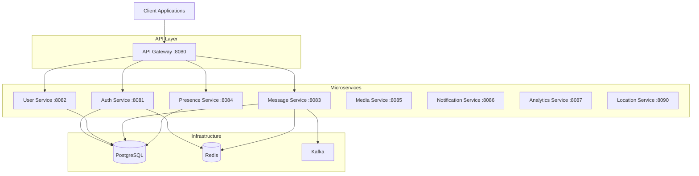

# Echo Backend

A production-ready, scalable microservices architecture for a real-time messaging platform built with Go. Echo Backend implements WhatsApp/Telegram-inspired design patterns with emphasis on clean architecture, observability, and developer experience.

[](https://go.dev/)
[](./docs/ARCHITECTURE.md)
[](LICENSE)

## Documentation

📚 **[Complete Documentation](./docs/)** - Comprehensive guides for development, API reference, and architecture

**Quick Links:**
- [Usage Guide](./docs/USAGE.md) - Developer workflows and commands
- [API Reference](./docs/API_REFERENCE.md) - REST API endpoints
- [WebSocket Protocol](./docs/WEBSOCKET_PROTOCOL.md) - Real-time messaging
- [Server Architecture](./docs/SERVER_ARCHITECTURE.md) - Implementation details
- [Database Schema](./docs/DATABASE_SCHEMA.md) - Complete schema reference
- [Guidelines](./docs/GUIDELINES.md) - Coding standards
- [Contributing](./docs/CONTRIBUTING.md) - How to contribute

## Features

- **Real-time Messaging** - WebSocket-based messaging with multi-device support
- **Phone-First Authentication** - OTP verification with JWT/refresh token flow
- **Multi-Device Support** - Hub-based architecture managing user sessions across devices
- **Microservices Architecture** - 9 independent, scalable services
- **Clean Architecture** - Interface-based design with clear separation of concerns
- **Production Ready** - Graceful shutdown, health checks, structured logging, metrics
- **Developer Friendly** - Comprehensive tooling, hot reload, Make targets

## Quick Start

### Prerequisites

- **Go** 1.21 or higher
- **Docker** and **Docker Compose**
- **Make** (for convenience commands)
- **PostgreSQL** 15+ (via Docker)
- **Redis** 7+ (via Docker)
- **Kafka** 3+ (via Docker)

### Get Started in 3 Minutes

```bash
# Clone the repository
git clone https://github.com/yourusername/echo-backend.git
cd echo-backend

# Start all services (infrastructure + microservices)
make up

# Check service health
make health

# View logs
make logs

# Stop all services
make down
```

That's it! Your messaging platform is now running:
- **API Gateway**: http://localhost:8080
- **Auth Service**: http://localhost:8081 (internal)
- **Message Service**: http://localhost:8083 (internal)
- **User Service**: http://localhost:8082 (internal)

### Test the System

```bash
# Register a new user
curl -X POST http://localhost:8080/api/v1/auth/register \
  -H "Content-Type: application/json" \
  -d '{
    "phone": "+1234567890",
    "password": "SecurePass123!",
    "name": "John Doe"
  }'

# Verify OTP (check logs for OTP code)
curl -X POST http://localhost:8080/api/v1/auth/verify-otp \
  -H "Content-Type: application/json" \
  -d '{
    "phone": "+1234567890",
    "otp": "123456"
  }'

# Login
curl -X POST http://localhost:8080/api/v1/auth/login \
  -H "Content-Type: application/json" \
  -d '{
    "phone": "+1234567890",
    "password": "SecurePass123!"
  }'
```

## Architecture Overview



For detailed architecture documentation, see [ARCHITECTURE.md](./docs/ARCHITECTURE.md)

## Services

| Service | Port | Status | Description |
|---------|------|--------|-------------|
| **api-gateway** | 8080 | ✅ Production | Reverse proxy, JWT validation, rate limiting |
| **auth-service** | 8081 | ✅ Production | Authentication, sessions, OTP verification |
| **message-service** | 8083 | ✅ Production | Real-time messaging, WebSocket, conversations |
| **user-service** | 8082 | ✅ Implemented | User profiles, contacts management |
| **location-service** | 8090 | ✅ Implemented | Phone number geolocation lookup |
| **presence-service** | 8084 | ✅ Implemented | Online status tracking |
| **media-service** | 8085 | 🚧 Placeholder | Media uploads, thumbnails, storage |
| **notification-service** | 8086 | 🚧 Placeholder | Push notifications (FCM/APNS) |
| **analytics-service** | 8087 | 🚧 Placeholder | Usage metrics and analytics |

## Project Structure

```
echo-backend/
├── services/              # Microservices
│   ├── api-gateway/      # Entry point for all client requests
│   ├── auth-service/     # Authentication & authorization
│   ├── message-service/  # Real-time messaging
│   ├── user-service/     # User management
│   ├── presence-service/ # Online status
│   ├── location-service/ # Geolocation
│   ├── media-service/    # Media handling
│   ├── notification-service/  # Push notifications
│   └── analytics-service/     # Analytics
├── shared/               # Shared libraries
│   ├── pkg/             # Core infrastructure
│   │   ├── database/    # PostgreSQL abstraction
│   │   ├── cache/       # Redis abstraction
│   │   ├── messaging/   # Kafka abstraction
│   │   ├── logger/      # Structured logging
│   │   └── ...
│   └── server/          # HTTP utilities
│       ├── router/      # Router with builder pattern
│       ├── middleware/  # 15+ middleware components
│       ├── response/    # Standardized responses
│       ├── shutdown/    # Graceful shutdown
│       └── health/      # Health check system
├── database/            # Database schemas & migrations
│   └── schemas/         # Domain-specific SQL schemas
├── infra/              # Infrastructure & deployment
│   ├── docker/         # Docker Compose files
│   └── scripts/        # Utility scripts
├── Makefile            # Development commands
└── go.work             # Go workspace configuration
```

## Development

### Available Make Commands

```bash
# Service Management
make up                  # Start all services
make down                # Stop all services
make rerun               # Rebuild and restart all services
make logs                # View logs from all services
make status              # Check service health
make health              # Run health checks

# Individual Service Commands
make auth-up             # Start auth service
make auth-down           # Stop auth service
make auth-rerun          # Rebuild and restart auth service
make auth-logs           # View auth service logs

# Database Operations
make db-init             # Initialize database schemas
make db-migrate          # Run migrations
make db-migrate-down     # Rollback last migration
make db-seed             # Seed test data
make db-reset            # Drop and recreate database
make db-connect          # Connect to PostgreSQL CLI

# Testing
make test                # Run all tests
make test-auth           # Test auth endpoints

# Infrastructure
make kafka-topics        # List Kafka topics
make redis-connect       # Connect to Redis CLI
```

For complete usage guide, see [USAGE.md](./USAGE.md)

### Development Workflow

1. **Start services**: `make up`
2. **Make changes** to your code
3. **Hot reload** will automatically restart the service
4. **View logs**: `make <service>-logs`
5. **Test changes**: `make test` or manual testing
6. **Stop services**: `make down`

## Technology Stack

### Backend
- **Language**: Go 1.21+
- **Web Framework**: Gorilla Mux
- **Database**: PostgreSQL 15 with pgx driver
- **Cache**: Redis 7
- **Message Queue**: Apache Kafka 3
- **WebSocket**: Gorilla WebSocket

### Infrastructure
- **Containerization**: Docker & Docker Compose
- **Logging**: Zap (structured logging)
- **Configuration**: Viper (YAML + env variables)
- **Authentication**: JWT with refresh tokens
- **Password Hashing**: Argon2id, bcrypt, scrypt

### Observability
- Structured JSON logging
- Request/correlation ID tracking
- Health check endpoints
- Graceful shutdown hooks
- Request duration tracking

## Key Features

### Builder Pattern
All services use the Builder pattern for safe dependency injection:

```go
authService := service.NewAuthServiceBuilder().
    WithRepo(authRepo).
    WithTokenService(tokenService).
    WithHashingService(hashingService).
    WithCache(cacheClient).
    WithConfig(&cfg.Auth).
    WithLogger(log).
    Build()  // Validates all dependencies
```

### Graceful Shutdown
Priority-based shutdown hooks ensure clean service termination:

```go
shutdown.Register(shutdown.HighPriority, "http-server", func(ctx context.Context) error {
    return server.Shutdown(ctx)
})
```

### Middleware Chain
Composable middleware with early/late execution:

```go
router.NewBuilder().
    WithEarlyMiddleware(RequestID, CorrelationID, RateLimiting).
    WithLateMiddleware(Recovery, RequestLogger).
    Build()
```

### Health Checks
Comprehensive health checking with custom checkers:

```go
healthManager.RegisterChecker("database", func(ctx context.Context) health.CheckResult {
    return health.CheckResult{Status: health.StatusUp}
})
```

## Configuration

Services use hierarchical configuration:
- Base: `config.yaml`
- Environment overrides: `config.dev.yaml`, `config.prod.yaml`
- Environment variable interpolation: `${DB_HOST:localhost}`

Example:
```yaml
database:
  host: ${DB_HOST:localhost}
  port: ${DB_PORT:5432}
  name: ${DB_NAME:echo}
  user: ${DB_USER:echo}
  password: ${DB_PASSWORD:echo}
```

## Database

### Multi-Schema Design
- `auth` - Authentication, sessions, OTP
- `users` - User profiles, contacts
- `messages` - Messages, conversations
- `media` - Media files, thumbnails
- `notifications` - Push tokens, preferences
- `analytics` - Usage metrics
- `location` - Phone number geolocation

### Key Features
- UUID primary keys
- Soft deletes (`deleted_at`)
- Automatic timestamps (`created_at`, `updated_at`)
- Row-Level Security (RLS)
- Full audit trail
- Device tracking with metadata

## API Documentation

### Authentication Endpoints

**Register User**
```http
POST /api/v1/auth/register
Content-Type: application/json

{
  "phone": "+1234567890",
  "password": "SecurePass123!",
  "name": "John Doe"
}
```

**Verify OTP**
```http
POST /api/v1/auth/verify-otp
Content-Type: application/json

{
  "phone": "+1234567890",
  "otp": "123456"
}
```

**Login**
```http
POST /api/v1/auth/login
Content-Type: application/json

{
  "phone": "+1234567890",
  "password": "SecurePass123!"
}
```

### Real-time Messaging

**WebSocket Connection**
```
ws://localhost:8083/ws
Headers:
  X-User-ID: <uuid>
  X-Device-ID: <device-id>
  X-Platform: ios|android|web
```

**Send Message**
```http
POST /api/v1/messages
Authorization: Bearer <token>
Content-Type: application/json

{
  "to_user_id": "uuid",
  "content": "Hello!",
  "type": "text"
}
```

## Contributing

We welcome contributions! Please see [CONTRIBUTING.md](./CONTRIBUTING.md) for guidelines.

### Development Guidelines

1. Follow the established service structure
2. Use the Builder pattern for service initialization
3. Write comprehensive tests
4. Use structured logging
5. Implement health checks
6. Add graceful shutdown hooks
7. Document your changes

See [GUIDELINES.md](./GUIDELINES.md) for detailed coding standards.

## Testing

```bash
# Run all tests
make test

# Test specific service
cd services/auth-service && go test -v ./...

# Test with coverage
go test -v -cover ./...

# Integration tests
make test-auth
```

## Deployment

### Docker Compose (Development)
```bash
ENV=dev make up
```

### Docker Compose (Production)
```bash
ENV=prod make up
```

### Environment Variables
```bash
# Database
DB_HOST=localhost
DB_PORT=5432
DB_NAME=echo
DB_USER=echo
DB_PASSWORD=echo

# Redis
REDIS_HOST=localhost
REDIS_PORT=6379

# Kafka
KAFKA_BROKERS=localhost:9092

# JWT
JWT_SECRET=your-secret-key
JWT_ACCESS_EXPIRY=15m
JWT_REFRESH_EXPIRY=7d
```

## Monitoring

### Health Endpoints
- `/health` - Liveness probe
- `/ready` - Readiness probe (checks dependencies)

### Logging
All services use structured JSON logging with:
- Request ID tracking
- Correlation ID propagation
- Request/response logging
- Error context

### Metrics
- Request duration tracking
- Connection pool stats
- Cache hit/miss rates
- WebSocket connection metrics

## Troubleshooting

### Services not starting
```bash
# Check Docker status
docker ps

# View service logs
make logs

# Check health
make health

# Rebuild services
make rerun
```

### Database connection issues
```bash
# Connect to database
make db-connect

# Check database status
docker exec -it echo-postgres pg_isready

# Reinitialize database
make db-reset
```

### Port conflicts
```bash
# Check if ports are in use
lsof -i :8080
lsof -i :5432

# Stop conflicting services
make down
```

## Performance

- **Concurrent Connections**: 10,000+ WebSocket connections per instance
- **Message Throughput**: 50,000+ messages/second
- **Response Time**: < 10ms (p50), < 50ms (p99)
- **Database**: Connection pooling with configurable limits
- **Cache**: Redis for sub-millisecond lookups

## Security

- Phone-first authentication with OTP verification
- JWT access tokens (15min) + refresh tokens (7 days)
- Password hashing with Argon2id
- Token blacklisting via Redis
- Rate limiting (fixed window, sliding window, token bucket)
- CORS protection
- Security headers
- Input validation
- SQL injection protection (parameterized queries)

## Roadmap

- [ ] Message encryption (E2E)
- [ ] Group messaging
- [ ] Voice/video calling
- [ ] Message reactions
- [ ] File attachments
- [ ] Message search
- [ ] Admin dashboard
- [ ] Kubernetes deployment
- [ ] Monitoring (Prometheus/Grafana)
- [ ] Distributed tracing (Jaeger)

## License

This project is licensed under the MIT License - see the [LICENSE](LICENSE) file for details.

## Support

- **Documentation**: [Complete Documentation](./docs/) | [Architecture](./docs/ARCHITECTURE.md) | [Usage Guide](./docs/USAGE.md) | [API Reference](./docs/API_REFERENCE.md)
- **Issues**: [GitHub Issues](https://github.com/yourusername/echo-backend/issues)
- **Discussions**: [GitHub Discussions](https://github.com/yourusername/echo-backend/discussions)

## Acknowledgments

Built with inspiration from:
- WhatsApp's messaging architecture
- Telegram's multi-device support
- Slack's real-time communication
- Discord's scalability patterns

---

**Built with ❤️ using Go**
