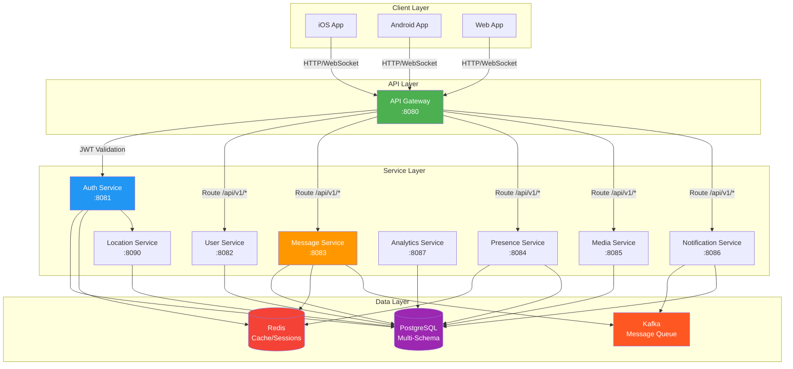
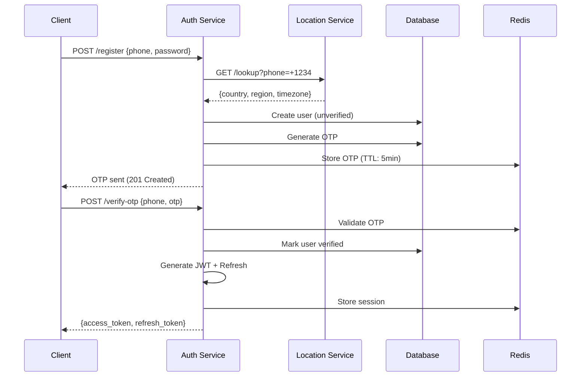
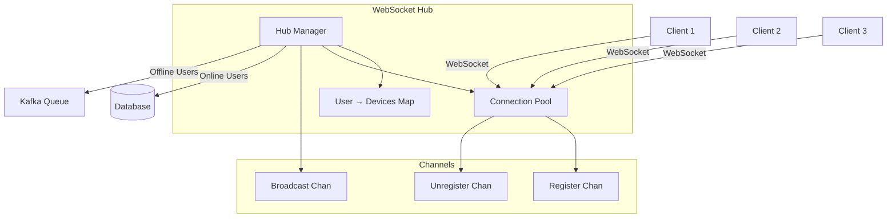
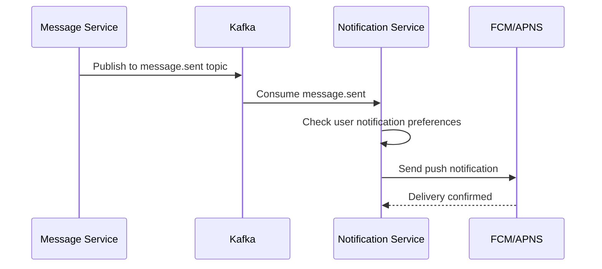
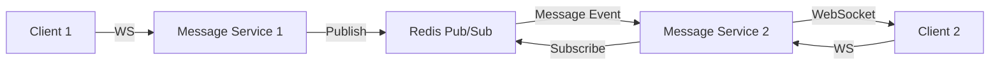

# Echo Backend Architecture

This document provides a comprehensive overview of the Echo Backend microservices architecture, design patterns, and technical decisions.

## Table of Contents

- [Overview](#overview)
- [System Architecture](#system-architecture)
- [Microservices](#microservices)
- [Shared Infrastructure](#shared-infrastructure)
- [Database Design](#database-design)
- [Communication Patterns](#communication-patterns)
- [Design Patterns](#design-patterns)
- [Security Architecture](#security-architecture)
- [Scalability & Performance](#scalability--performance)
- [Observability](#observability)

## Overview

Echo Backend is a production-ready messaging platform built with Go, following microservices architecture principles. The system is designed for:

- **Scalability**: Horizontal scaling of independent services
- **Reliability**: Fault tolerance, graceful degradation
- **Maintainability**: Clean architecture, clear boundaries
- **Performance**: Sub-10ms response times, 10K+ concurrent connections
- **Developer Experience**: Hot reload, comprehensive tooling, clear patterns

### Key Metrics

- **Services**: 9 microservices (6 implemented, 3 placeholders)
- **Code**: 25,000+ lines of Go code
- **Database Schemas**: 7 domain-specific schemas
- **Shared Components**: 15+ reusable middleware, 5 infrastructure abstractions
- **Test Coverage**: Growing (target: 80%+)

## System Architecture

### High-Level Architecture



### Architecture Principles

1. **Service Independence**: Each service owns its data and logic
2. **Interface-Based Design**: All dependencies are interfaces
3. **Asynchronous Communication**: Kafka for event-driven patterns
4. **Stateless Services**: State stored in databases/cache only
5. **API Gateway Pattern**: Single entry point for clients
6. **Database per Service**: Schema-level isolation
7. **Graceful Degradation**: Services continue with reduced functionality

## Microservices

### 1. API Gateway (:8080)

**Purpose**: Single entry point for all client requests

**Responsibilities**:
- Route requests to appropriate services
- JWT token validation
- Rate limiting (global and per-endpoint)
- Request/response transformation
- Health check aggregation
- CORS handling

**Key Features**:
- Path-based routing with prefix mapping
- Dynamic route configuration via YAML
- Circuit breaker for downstream services
- Request deduplication
- Response caching

**Routes Configuration**:
```yaml
routes:
  - path: /api/v1/auth/*
    target: http://auth-service:8081
    strip_prefix: /api/v1/auth
  - path: /api/v1/messages/*
    target: http://message-service:8083
    auth_required: true
```

### 2. Auth Service (:8081)

**Purpose**: Authentication and authorization

**Responsibilities**:
- User registration with OTP verification
- Login/logout with JWT tokens
- Session management (multi-device)
- Password management (reset, change)
- Token refresh and blacklisting
- OAuth integration (Google, Apple)

**Authentication Flow**:


**Token Strategy**:
- **Access Token**: JWT, 15 minutes, includes user_id, device_id, roles
- **Refresh Token**: UUID, 7 days, stored in database
- **Blacklisting**: Redis set for revoked tokens

### 3. Message Service (:8083)

**Purpose**: Real-time messaging and conversation management

**Responsibilities**:
- WebSocket connection management
- Message sending/receiving
- Delivery tracking (sent → delivered → read)
- Typing indicators
- Read receipts
- Message editing/deletion
- Conversation management

**WebSocket Hub Architecture**:


**Hub Implementation**:
- One goroutine per Hub managing all connections
- User → [Device connections] mapping
- Automatic cleanup of stale connections
- Graceful shutdown with connection draining
- Metrics: active connections, messages sent, broadcast count

**Message Flow**:
1. Client sends message via REST API
2. Service saves to database
3. Creates delivery records for recipients
4. If recipient online: send via WebSocket (mark delivered)
5. If recipient offline: publish to Kafka → Notification Service
6. Client receives read receipt → update delivery status

### 4. User Service (:8082)

**Purpose**: User profile and contact management

**Responsibilities**:
- User profile CRUD
- Profile updates (name, bio, avatar)
- Contact management
- User blocking
- Privacy settings
- User search

**Profile Structure**:
```go
type Profile struct {
    UserID        uuid.UUID
    DisplayName   string
    Bio           string
    AvatarURL     string
    Status        string // online, away, busy, offline
    LastSeen      time.Time
    PhoneVisible  bool
    ProfileVisible bool
}
```

### 5. Presence Service (:8084)

**Purpose**: Track user online status and activity

**Responsibilities**:
- Online/offline status tracking
- Last seen timestamps
- Activity status (typing, recording)
- Presence broadcasting

**Redis Strategy**:
- User presence: `presence:{user_id}` → {status, last_seen, device_ids}
- TTL-based expiration for automatic offline marking
- Pub/Sub for real-time presence updates

### 6. Location Service (:8090)

**Purpose**: Phone number geolocation

**Responsibilities**:
- Phone number to country mapping
- Region and timezone lookup
- Carrier information (optional)

**Usage**:
```http
GET /lookup?phone=+1234567890
Response:
{
  "country": "US",
  "country_code": "+1",
  "region": "California",
  "timezone": "America/Los_Angeles"
}
```

### 7-9. Placeholder Services

**Media Service** (:8085):
- File uploads (images, videos, documents)
- Thumbnail generation
- CDN integration
- Storage management (S3/R2)

**Notification Service** (:8086):
- Push notification delivery (FCM, APNS)
- Notification preferences
- Device token management
- Kafka consumer for offline messages

**Analytics Service** (:8087):
- Usage metrics collection
- User activity tracking
- Message analytics
- Dashboard data aggregation

## Shared Infrastructure

### Shared Package Structure

```
shared/
├── pkg/                  # Core infrastructure
│   ├── database/        # PostgreSQL interface
│   ├── cache/           # Redis interface
│   ├── messaging/       # Kafka interface
│   ├── logger/          # Structured logging
│   ├── config/          # Configuration utilities
│   ├── errors/          # Error handling
│   └── storage/         # Object storage (R2)
└── server/              # HTTP utilities
    ├── router/          # Router builder
    ├── middleware/      # 15+ middleware
    ├── response/        # Standard responses
    ├── shutdown/        # Graceful shutdown
    ├── health/          # Health checks
    └── common/          # Token, hashing, encryption
```

### Database Abstraction

**Interface Design**:
```go
type Database interface {
    // CRUD Operations
    Create(ctx context.Context, model Model) error
    FindByID(ctx context.Context, model Model, id interface{}) error
    Update(ctx context.Context, model Model) error
    Delete(ctx context.Context, model Model) error  // Soft delete
    HardDelete(ctx context.Context, model Model) error

    // Query Operations
    FindOne(ctx context.Context, model Model, query string, args ...interface{}) error
    FindMany(ctx context.Context, models interface{}, query string, args ...interface{}) error
    Query(ctx context.Context, query string, args ...interface{}) (Rows, error)
    Exec(ctx context.Context, query string, args ...interface{}) error

    // Transaction Support
    WithTransaction(ctx context.Context, fn func(tx Transaction) error) error

    // Health & Stats
    Ping(ctx context.Context) error
    Stats() Stats
    Close() error
}
```

**Model Interface**:
```go
type Model interface {
    TableName() string   // e.g., "auth.users"
    PrimaryKey() string  // e.g., "id"
}
```

### Cache Abstraction

**Interface Design**:
```go
type Cache interface {
    // Basic Operations
    Get(ctx context.Context, key string) ([]byte, error)
    Set(ctx context.Context, key string, value []byte, ttl time.Duration) error
    Delete(ctx context.Context, key string) error

    // Batch Operations
    GetMulti(ctx context.Context, keys []string) (map[string][]byte, error)
    SetMulti(ctx context.Context, items map[string][]byte, ttl time.Duration) error

    // Atomic Operations
    Increment(ctx context.Context, key string, delta int64) (int64, error)
    Decrement(ctx context.Context, key string, delta int64) (int64, error)

    // TTL Management
    Expire(ctx context.Context, key string, ttl time.Duration) error
    TTL(ctx context.Context, key string) (time.Duration, error)

    // Type-Safe Helpers
    GetString(ctx context.Context, key string) (string, error)
    SetString(ctx context.Context, key string, value string, ttl time.Duration) error
    GetInt(ctx context.Context, key string) (int64, error)
    SetInt(ctx context.Context, key string, value int64, ttl time.Duration) error
}
```

### Middleware Components

**Available Middleware** (15+ components):

1. **RequestID**: Generate unique request ID
2. **CorrelationID**: Extract/generate correlation ID
3. **RequestReceivedLogger**: Log incoming requests
4. **RequestCompletedLogger**: Log request completion with duration
5. **Recovery**: Panic recovery with stack traces
6. **Timeout**: Request timeout enforcement
7. **BodyLimit**: Limit request body size
8. **RateLimit**: Multiple strategies (fixed window, sliding window, token bucket)
9. **Auth**: JWT token validation
10. **CORS**: Cross-origin resource sharing
11. **SecurityHeaders**: Security headers (CSP, HSTS, etc.)
12. **CacheControl**: Cache control headers
13. **Compression**: Gzip compression
14. **InterceptUserId**: Extract user ID from context
15. **InterceptSessionId**: Extract session ID from context

**Middleware Chain**:
```go
router.NewBuilder().
    // Early middleware (before route matching)
    WithEarlyMiddleware(
        middleware.RequestID(),
        middleware.CorrelationID(),
        middleware.RequestReceivedLogger(logger),
        middleware.RateLimit(limiter),
    ).
    // Late middleware (after route matching)
    WithLateMiddleware(
        middleware.Recovery(logger),
        middleware.Auth(tokenService),
        middleware.RequestCompletedLogger(logger),
    ).
    Build()
```

## Database Design

### Multi-Schema Architecture

Each service has a dedicated schema for data isolation:

```
PostgreSQL Database: echo
├── auth schema            # Auth Service
├── users schema           # User Service
├── messages schema        # Message Service
├── media schema           # Media Service
├── notifications schema   # Notification Service
├── analytics schema       # Analytics Service
└── location schema        # Location Service
```

### Schema: auth

**Tables**:
- `users` - User accounts (phone, password_hash, verified, locked)
- `sessions` - Active user sessions with device info
- `otp_verifications` - OTP codes for verification
- `refresh_tokens` - Refresh token storage
- `oauth_providers` - OAuth integration data
- `login_history` - Login attempts and history

**Key Features**:
- UUID primary keys
- Phone number uniqueness
- Password history tracking
- Account lockout after failed attempts
- Device fingerprinting (OS, browser, model, location)
- Session expiration via TTL

### Schema: users

**Tables**:
- `profiles` - User profiles (name, bio, avatar, status)
- `contacts` - User contact relationships
- `blocked_users` - Blocked user list
- `privacy_settings` - Privacy preferences

### Schema: messages

**Tables**:
- `conversations` - Conversation metadata
- `messages` - Individual messages
- `delivery_tracking` - Message delivery status per recipient
- `message_reactions` - Emoji reactions
- `message_threads` - Threaded conversations

**Message Types**:
- `text` - Plain text
- `image` - Image with optional caption
- `video` - Video with thumbnail
- `audio` - Voice message
- `document` - File attachment
- `location` - GPS coordinates
- `contact` - Shared contact

**Delivery Status Flow**:
```
sent → delivered → read
```

### Common Patterns

**Soft Deletes**:
```sql
deleted_at TIMESTAMP NULL DEFAULT NULL
```

**Automatic Timestamps**:
```sql
created_at TIMESTAMP NOT NULL DEFAULT CURRENT_TIMESTAMP
updated_at TIMESTAMP NOT NULL DEFAULT CURRENT_TIMESTAMP
-- Trigger updates updated_at on every UPDATE
```

**UUID Generation**:
```sql
id UUID PRIMARY KEY DEFAULT gen_random_uuid()
```

**JSONB Metadata**:
```sql
metadata JSONB DEFAULT '{}'::jsonb
```

## Communication Patterns

### Synchronous (HTTP/REST)

**When to Use**:
- Client-to-service requests
- Service-to-service for critical path
- Real-time responses required

**Example**: User registration, login, message sending

### Asynchronous (Kafka)

**When to Use**:
- Offline notifications
- Event broadcasting
- Analytics events
- Non-critical path operations

**Topics**:
- `user.registered` - New user events
- `message.sent` - Offline message delivery
- `presence.updated` - Presence change events
- `analytics.events` - Usage metrics

**Example Flow**:


### Real-Time (WebSocket)

**When to Use**:
- Real-time messaging
- Typing indicators
- Presence updates
- Live notifications

**Connection Flow**:
```
1. Client opens WebSocket: ws://host/ws
2. Client sends auth headers (X-User-ID, X-Device-ID)
3. Hub registers client connection
4. Hub sends welcome message
5. Client receives real-time events
6. Client sends heartbeat every 30s
7. Hub removes stale connections after 60s
```

## Design Patterns

### 1. Builder Pattern

**Purpose**: Construct services with validated dependencies

**Implementation**:
```go
type AuthServiceBuilder struct {
    repo           AuthRepository
    tokenService   TokenService
    hashingService HashingService
    cache          Cache
    config         *Config
    logger         Logger
}

func NewAuthServiceBuilder() *AuthServiceBuilder {
    return &AuthServiceBuilder{}
}

func (b *AuthServiceBuilder) WithRepo(repo AuthRepository) *AuthServiceBuilder {
    b.repo = repo
    return b
}

// ... other With methods ...

func (b *AuthServiceBuilder) Build() *AuthService {
    // Validate required dependencies
    if b.repo == nil {
        panic("AuthRepository is required")
    }
    if b.tokenService == nil {
        panic("TokenService is required")
    }

    return &AuthService{
        repo:           b.repo,
        tokenService:   b.tokenService,
        hashingService: b.hashingService,
        cache:          b.cache,
        config:         b.config,
        logger:         b.logger,
    }
}
```

**Benefits**:
- Explicit dependency declaration
- Compile-time safety
- Clear initialization flow
- Panic early on missing dependencies

### 2. Repository Pattern

**Purpose**: Abstract data access layer

**Implementation**:
```go
type AuthRepository interface {
    CreateUser(ctx context.Context, user *User) error
    FindUserByPhone(ctx context.Context, phone string) (*User, error)
    UpdateUser(ctx context.Context, user *User) error
    DeleteUser(ctx context.Context, userID uuid.UUID) error
}

type authRepository struct {
    db Database
}

func (r *authRepository) CreateUser(ctx context.Context, user *User) error {
    return r.db.Create(ctx, user)
}
```

**Benefits**:
- Testability via mocking
- Swap implementations easily
- Consistent data access patterns

### 3. Middleware Chain Pattern

**Purpose**: Composable request processing

**Implementation**:
```go
type Middleware func(http.Handler) http.Handler

type Chain struct {
    middlewares []Middleware
}

func (c *Chain) Append(m Middleware) *Chain {
    c.middlewares = append(c.middlewares, m)
    return c
}

func (c *Chain) Then(h http.Handler) http.Handler {
    for i := len(c.middlewares) - 1; i >= 0; i-- {
        h = c.middlewares[i](h)
    }
    return h
}
```

### 4. Graceful Shutdown Pattern

**Purpose**: Clean service termination

**Implementation**:
```go
type Hook struct {
    priority int
    name     string
    fn       func(context.Context) error
}

func Register(priority int, name string, fn func(context.Context) error) {
    hooks = append(hooks, Hook{priority, name, fn})
}

func Shutdown(ctx context.Context) {
    // Sort by priority (High → Low)
    sort.Slice(hooks, func(i, j int) bool {
        return hooks[i].priority > hooks[j].priority
    })

    // Execute hooks
    for _, hook := range hooks {
        if err := hook.fn(ctx); err != nil {
            logger.Error("Shutdown hook failed", hook.name, err)
        }
    }
}
```

**Priority Levels**:
- **High (100)**: Stop accepting requests, HTTP server shutdown
- **Normal (50)**: Close database connections, cache cleanup
- **Low (10)**: Flush logs, final cleanup

## Security Architecture

### Authentication

**Phone-First Model**:
1. User registers with phone number + password
2. OTP sent to phone (via SMS)
3. User verifies OTP
4. System generates JWT access token + refresh token
5. Client stores tokens securely

**JWT Token Structure**:
```json
{
  "user_id": "uuid",
  "device_id": "device-uuid",
  "roles": ["user"],
  "iat": 1234567890,
  "exp": 1234568790
}
```

### Authorization

**Middleware Chain**:
```
Request → RequestID → CorrelationID → RateLimit → Auth → Handler
```

**Auth Middleware**:
1. Extract JWT from `Authorization: Bearer <token>` header
2. Validate token signature
3. Check token expiration
4. Check token blacklist (Redis)
5. Extract user_id and store in context
6. Pass to handler

### Password Security

**Hashing Algorithms** (in order of preference):
1. **Argon2id** - Memory-hard, GPU-resistant (recommended)
2. **bcrypt** - Industry standard
3. **scrypt** - Alternative memory-hard

**Configuration**:
```yaml
auth:
  hashing:
    algorithm: argon2id
    argon2:
      memory: 65536      # 64 MB
      iterations: 3
      parallelism: 2
      salt_length: 16
      key_length: 32
```

### Rate Limiting

**Strategies**:

1. **Fixed Window**: Simple, memory-efficient
   - 100 requests per 1 minute window

2. **Sliding Window**: More accurate
   - Smooth rate limiting across window boundaries

3. **Token Bucket**: Burst handling
   - Bucket capacity: 100 tokens
   - Refill rate: 10 tokens/second

**Application**:
```go
middleware.RateLimit(middleware.RateLimitConfig{
    Strategy:   middleware.TokenBucket,
    Capacity:   100,
    RefillRate: 10,
    KeyFunc: func(r *http.Request) string {
        return extractUserID(r)  // Per-user limiting
    },
})
```

### Security Headers

**Applied by Middleware**:
- `X-Content-Type-Options: nosniff`
- `X-Frame-Options: DENY`
- `X-XSS-Protection: 1; mode=block`
- `Strict-Transport-Security: max-age=31536000`
- `Content-Security-Policy: default-src 'self'`

## Scalability & Performance

### Horizontal Scaling

**Stateless Services**: All services can scale horizontally
- No in-memory state (except WebSocket Hub)
- Session data in Redis
- Database connection pooling

**Load Balancing**:
```
[Client] → [Load Balancer] → [API Gateway 1..N]
                           → [Auth Service 1..N]
                           → [Message Service 1..N]
```

### Caching Strategy

**Cache Layers**:
1. **Application Cache** (Redis):
   - User sessions: `session:{session_id}`
   - User profiles: `profile:{user_id}`
   - Token blacklist: `token:blacklist:{token_id}`

2. **Query Result Cache**:
   - Recent messages: `messages:{conversation_id}:recent`
   - User contacts: `contacts:{user_id}`

**TTL Strategy**:
- Sessions: 7 days
- Profiles: 1 hour
- Recent messages: 5 minutes
- Token blacklist: Until token expiry

### Database Optimization

**Connection Pooling**:
```yaml
database:
  max_open_connections: 25
  max_idle_connections: 10
  connection_lifetime: 5m
  connection_idle_timeout: 10m
```

**Indexing Strategy**:
- Primary keys: UUID with index
- Foreign keys: Indexed automatically
- Search columns: `phone`, `email`, `conversation_id`
- Composite indexes: `(user_id, deleted_at)` for soft deletes

**Query Optimization**:
- Use prepared statements
- Limit result sets with pagination
- Avoid N+1 queries (use JOIN or batch loading)

### WebSocket Scaling

**Challenge**: WebSocket connections are stateful

**Solution**: Sticky sessions or Redis Pub/Sub

**Redis Pub/Sub Approach**:


## Observability

### Structured Logging

**Format**: JSON in production, Console in development

**Fields**:
- `timestamp` - ISO 8601
- `level` - debug, info, warn, error, fatal
- `request_id` - Unique per request
- `correlation_id` - Across services
- `service` - Service name
- `message` - Log message
- `context` - Additional context

**Example**:
```json
{
  "timestamp": "2024-01-15T10:30:45Z",
  "level": "info",
  "request_id": "req_abc123",
  "correlation_id": "corr_xyz789",
  "service": "auth-service",
  "message": "User registered successfully",
  "context": {
    "user_id": "uuid",
    "phone": "+1234567890",
    "duration_ms": 45
  }
}
```

### Health Checks

**Endpoints**:
- `/health` - Liveness probe (always returns 200)
- `/ready` - Readiness probe (checks dependencies)

**Readiness Checks**:
```go
healthManager.RegisterChecker("database", func(ctx context.Context) CheckResult {
    if err := db.Ping(ctx); err != nil {
        return CheckResult{Status: StatusDown, Message: err.Error()}
    }
    return CheckResult{Status: StatusUp}
})

healthManager.RegisterChecker("cache", func(ctx context.Context) CheckResult {
    if err := cache.Ping(ctx); err != nil {
        return CheckResult{Status: StatusDegraded, Message: "Cache unavailable"}
    }
    return CheckResult{Status: StatusUp}
})
```

**Response**:
```json
{
  "status": "up",
  "timestamp": "2024-01-15T10:30:45Z",
  "checks": {
    "database": {"status": "up", "duration_ms": 5},
    "cache": {"status": "up", "duration_ms": 2}
  }
}
```

### Metrics

**Key Metrics** (to be implemented):
- Request rate (requests/second)
- Response time (p50, p95, p99)
- Error rate (errors/second)
- Active connections (WebSocket)
- Database connection pool usage
- Cache hit/miss rate

### Tracing

**Distributed Tracing** (planned):
- Request → API Gateway → Auth Service → Database
- Correlation ID propagation via headers
- Integration with Jaeger/Zipkin

---

**Last Updated**: January 2025
**Version**: 1.0.0
