# Echo Backend Architecture

Comprehensive overview of Echo Backend's microservices architecture, design patterns, and technical decisions - based on **ACTUAL** implementation.

## Table of Contents

- [Overview](#overview)
- [System Architecture](#system-architecture)
- [Microservices](#microservices)
- [Shared Infrastructure](#shared-infrastructure)
- [Database Design](#database-design)
- [Communication Patterns](#communication-patterns)
- [Design Patterns](#design-patterns)
- [Security Architecture](#security-architecture)
- [Scalability & Performance](#scalability--performance)
- [Observability](#observability)

## Overview

Echo Backend is a production-ready messaging platform built with Go, following microservices architecture principles. The system is designed for:

- **Scalability**: Horizontal scaling of independent services
- **Reliability**: Fault tolerance, graceful degradation, priority-based shutdown
- **Maintainability**: Clean architecture, Builder pattern, interface-based design
- **Performance**: Sub-10ms response times, 10K+ concurrent WebSocket connections
- **Developer Experience**: Hot reload, comprehensive tooling, clear patterns

### Implementation Status

- **Services**: 9 microservices total
  - **✅ Fully Implemented**: 5 services (API Gateway, Auth, Message, User, Location)
  - **🚧 Partial**: 2 services (Presence - stubbed routes, Media - placeholder)
  - **❌ Placeholder**: 2 services (Notification, Analytics - empty implementations)
- **Database Schemas**: 7 domain-specific schemas (all defined, not all fully used)
- **Shared Components**: 15+ reusable middleware, 5 infrastructure abstractions

## System Architecture

### High-Level Architecture

```mermaid
graph TB
    subgraph "Client Layer"
        iOS[iOS App]
        Android[Android App]
        Web[Web App]
    end

    subgraph "API Layer"
        Gateway[API Gateway<br/>:8080<br/>✅ IMPLEMENTED]
    end

    subgraph "Service Layer - Implemented"
        Auth[Auth Service<br/>:8081<br/>✅ IMPLEMENTED]
        User[User Service<br/>:8082<br/>⚠️ PARTIAL]
        Message[Message Service<br/>:8083<br/>✅ IMPLEMENTED]
        Location[Location Service<br/>:8090<br/>✅ IMPLEMENTED]
    end

    subgraph "Service Layer - Placeholder"
        Presence[Presence Service<br/>:8085<br/>🚧 STUBBED]
        Media[Media Service<br/>:8084<br/>❌ PLACEHOLDER]
        Notification[Notification Service<br/>:8086<br/>❌ PLACEHOLDER]
        Analytics[Analytics Service<br/>:8087<br/>❌ PLACEHOLDER]
    end

    subgraph "Data Layer"
        DB[(PostgreSQL<br/>Multi-Schema)]
        Redis[(Redis<br/>Cache/Sessions)]
        Kafka[Kafka<br/>Message Queue]
    end

    iOS & Android & Web -->|HTTP/WebSocket| Gateway

    Gateway -->|JWT Validation| Auth
    Gateway -->|Proxy Routes| User & Message & Presence & Media

    Auth --> DB & Redis & Location
    User --> DB
    Message --> DB & Redis & Kafka
    Location --> DB

    style Gateway fill:#4CAF50,color:#fff
    style Auth fill:#2196F3,color:#fff
    style Message fill:#FF9800,color:#fff
    style DB fill:#9C27B0,color:#fff
    style Redis fill:#F44336,color:#fff
    style Kafka fill:#FF5722,color:#fff
```



### Architecture Principles

1. **Service Independence**: Each service owns its data and logic
2. **Interface-Based Design**: All dependencies are interfaces for testability
3. **Asynchronous Communication**: Kafka for event-driven patterns (offline messages)
4. **Stateless Services**: State stored in databases/cache only (except WebSocket Hub)
5. **API Gateway Pattern**: Single entry point for all client requests
6. **Database per Service**: Schema-level isolation within single PostgreSQL instance
7. **Graceful Degradation**: Services continue with reduced functionality when dependencies unavailable

---

## Microservices

### 1. API Gateway (:8080) - ✅ IMPLEMENTED

**Purpose**: Single entry point for all client requests

**Responsibilities**:
- Reverse proxy to downstream services
- JWT token validation via middleware
- Global rate limiting (fixed window, sliding window, token bucket)
- Request/response logging with correlation IDs
- CORS handling
- Security headers
- Health check aggregation

**Key Features**:
- Path-based routing with prefix transformation
- Dynamic route configuration via YAML
- Compression support (gzip)
- TLS support (optional)
- Request deduplication via RequestID

**Route Configuration** (`services/api-gateway/configs/routes.yaml`):
```yaml
router_groups:
  - prefix: /api/v1/auth
    service: auth-service
    transform: /api/v1/auth -> /
    methods: [POST]

  - prefix: /api/v1/messages
    service: message-service
    transform: /api/v1/messages -> /
    methods: [GET, POST, PUT, DELETE]
```

**Middleware Stack**:
```
Early Middleware (before routing):
  1. RequestID
  2. CorrelationID
  3. RequestReceivedLogger
  4. GlobalRateLimiting
  5. Auth (JWT validation, skip paths: /health, /register, /login)

Late Middleware (after routing):
  1. RequestCompletedLogger

Common Chain:
  - Recovery
  - SecurityHeaders
  - APIVersion
  - CORS
  - CacheControl
  - Compression
```

---

### 2. Auth Service (:8081) - ✅ IMPLEMENTED

**Purpose**: Authentication and session management

**Implementation Status**: **ONLY 2 endpoints implemented**

**Actual Endpoints**:
- `POST /register` - Email-based registration
- `POST /login` - Email/password authentication

**Responsibilities**:
- User registration with email + password
- Login with JWT token generation
- Session management (multi-device support)
- Password hashing (Argon2id, bcrypt, scrypt)
- Integration with Location Service for IP geolocation

**Authentication Flow**:


**Token Strategy**:
- **Access Token**: JWT, 15 minutes, includes user_id, device_id
- **Refresh Token**: JWT, 7 days
- **Blacklisting**: Not yet implemented (planned for Redis)
- **Session Storage**: PostgreSQL + Redis cache

**What's NOT Implemented**:
- ❌ OTP verification endpoints
- ❌ Phone-based authentication
- ❌ Logout endpoint
- ❌ Token refresh endpoint
- ❌ Password reset endpoints
- ❌ OAuth integration (schema defined, not implemented)

---

### 3. Message Service (:8083) - ✅ IMPLEMENTED

**Purpose**: Real-time messaging and conversation management

**Implementation Status**: **9 REST endpoints + WebSocket**

**Actual Endpoints**:
- `GET /ws` - WebSocket connection for real-time messaging
- `POST /` - Send a new message
- `GET /` - Get messages with pagination
- `PUT /{id}` - Edit a message
- `DELETE /{id}` - Delete a message
- `POST /read` - Mark message(s) as read
- `POST /typing` - Send typing indicator
- `POST /conversations` - Create new conversation
- `GET /conversations` - Get user's conversations

**WebSocket Hub Architecture**:


**Hub Implementation Details**:
- **Multi-Device Support**: One user can have multiple connected devices
- **Buffer Sizes**:
  - Client send buffer: 256 messages
  - Register/Unregister: 256 clients
  - Broadcast channel: 1024 messages
- **Max Message Size**: 1 MB
- **Heartbeat**: Ping every 45 seconds, timeout after 90 seconds
- **Cleanup**: Automatic removal of stale connections every 90 seconds

**WebSocket Events** (Only 3 events supported):
1. **read_receipt**: Mark message as read
2. **typing**: Send typing indicator (TTL: 3 seconds)
3. **ping**: Connection keep-alive

**Message Flow**:
1. Client sends message via `POST /` (REST API)
2. Service saves to `messages.messages` table
3. Creates delivery records in `messages.delivery_status`
4. Hub checks if recipients are online:
   - **Online**: Send via WebSocket, mark as delivered
   - **Offline**: Publish to Kafka topic `notifications`
5. Recipient sends read receipt → update delivery status to 'read'

See [WebSocket Protocol](./WEBSOCKET_PROTOCOL.md) for complete protocol details.

---

### 4. User Service (:8082) - ⚠️ PARTIAL

**Purpose**: User profile management

**Implementation Status**: **ONLY 2 endpoints**

**Actual Endpoints**:
- `POST /` - Create or update user profile
- `GET /{user_id}` - Get user profile by ID

**Features**:
- Automatic username generation if not provided
- Update existing profile if already exists for user_id
- Profile fields: username, display_name, bio, avatar_url

**What's NOT Implemented**:
- ❌ Contact management
- ❌ User blocking
- ❌ Privacy settings
- ❌ User search
- ❌ Profile picture upload

---

### 5. Location Service (:8090) - ✅ IMPLEMENTED

**Purpose**: IP address and phone number geolocation

**Implementation Status**: **2 endpoints**

**Actual Endpoints**:
- `GET /health` - Health check
- `GET /lookup?ip={ip_address}` - IP geolocation lookup

**Responsibilities**:
- IP address to country/region/timezone mapping
- Used by Auth Service during registration/login
- Stores geolocation data in `location` schema

**Example Usage**:
```http
GET /lookup?ip=8.8.8.8

Response:
{
  "success": true,
  "data": {
    "ip": "8.8.8.8",
    "country": "United States",
    "country_code": "US",
    "region": "California",
    "city": "Mountain View",
    "timezone": "America/Los_Angeles",
    "isp": "Google LLC",
    "coordinates": {
      "latitude": 37.386,
      "longitude": -122.084
    }
  }
}
```

---

### 6. Presence Service (:8085) - 🚧 STUBBED

**Status**: Routes defined, no actual implementation

**Planned Features**:
- Online/offline status tracking
- Last seen timestamps
- Activity status (typing, recording)
- Presence broadcasting via WebSocket

---

### 7. Media Service (:8084) - ❌ PLACEHOLDER

**Status**: Placeholder service with empty handlers

**Planned Features**:
- File uploads (images, videos, documents)
- Thumbnail generation
- Media storage (S3/Cloudflare R2)
- CDN integration

---

### 8. Notification Service (:8086) - ❌ PLACEHOLDER

**Status**: No implementation

**Planned Features**:
- Push notification delivery (FCM, APNS)
- Kafka consumer for offline messages
- Device token management
- Notification preferences

---

### 9. Analytics Service (:8087) - ❌ PLACEHOLDER

**Status**: No implementation

**Planned Features**:
- Usage metrics collection
- User activity tracking
- Message analytics
- Dashboard data aggregation

---

## Shared Infrastructure

### Package Structure

```
shared/
├── pkg/                    # Core infrastructure abstractions
│   ├── database/          # PostgreSQL interface + implementation
│   ├── cache/             # Redis interface + implementation
│   ├── messaging/         # Kafka interface + implementation
│   ├── logger/            # Structured logging (Zap adapter)
│   ├── config/            # Configuration utilities
│   ├── errors/            # Error handling
│   └── storage/           # Object storage (planned)
└── server/                # HTTP server utilities
    ├── router/            # Gorilla mux wrapper with Builder
    ├── middleware/        # 15+ middleware components
    ├── response/          # Standardized JSON responses
    ├── shutdown/          # Graceful shutdown with priorities
    ├── health/            # Health check system
    ├── headers/           # Standard header constants
    ├── context/           # Context key constants
    └── common/            # Token, hashing, encryption services
```

### Database Abstraction

**Interface**: `shared/pkg/database/database.go`

```go
type Database interface {
    // CRUD Operations
    Create(ctx context.Context, model Model) error
    FindByID(ctx context.Context, model Model, id interface{}) error
    FindOne(ctx context.Context, model Model, query string, args ...interface{}) error
    FindAll(ctx context.Context, models interface{}, query string, args ...interface{}) error
    Update(ctx context.Context, model Model) error
    Delete(ctx context.Context, model Model) error        // Soft delete
    HardDelete(ctx context.Context, model Model) error

    // Raw Queries
    RawQuery(ctx context.Context, query string, args ...interface{}) (Rows, error)
    RawExec(ctx context.Context, query string, args ...interface{}) error

    // Transactions
    WithTransaction(ctx context.Context, fn func(tx Transaction) error) error

    // Health & Lifecycle
    Ping(ctx context.Context) error
    Stats() Stats
    Close() error
}

type Model interface {
    TableName() string   // e.g., "auth.users"
    PrimaryKey() string  // e.g., "id"
}
```

**Implementation**: PostgreSQL with pgx driver

### Cache Abstraction

**Interface**: `shared/pkg/cache/cache.go`

```go
type Cache interface {
    // Basic Operations
    Get(ctx context.Context, key string) ([]byte, error)
    Set(ctx context.Context, key string, value []byte, ttl time.Duration) error
    Delete(ctx context.Context, key string) error

    // Batch Operations
    GetMulti(ctx context.Context, keys []string) (map[string][]byte, error)
    SetMulti(ctx context.Context, items map[string][]byte, ttl time.Duration) error

    // Atomic Operations
    Increment(ctx context.Context, key string, delta int64) (int64, error)
    Decrement(ctx context.Context, key string, delta int64) (int64, error)

    // TTL Management
    Expire(ctx context.Context, key string, ttl time.Duration) error
    TTL(ctx context.Context, key string) (time.Duration, error)

    // Type-Safe Helpers
    GetString(ctx context.Context, key string) (string, error)
    SetString(ctx context.Context, key string, value string, ttl time.Duration) error
    GetInt(ctx context.Context, key string) (int64, error)
    SetInt(ctx context.Context, key string, value int64, ttl time.Duration) error

    // Health & Lifecycle
    Ping(ctx context.Context) error
    Close() error
}
```

**Implementation**: Redis 7+

### Middleware Components

**Available Middleware** (15+ components in `shared/server/middleware/`):

| Middleware | Purpose | Configuration |
|------------|---------|---------------|
| **RequestID** | Generate unique request ID | Header name |
| **CorrelationID** | Distributed tracing ID | Header name |
| **RequestReceivedLogger** | Log incoming requests | Logger instance |
| **RequestCompletedLogger** | Log completion + duration | Logger instance |
| **Recovery** | Panic recovery with stack trace | Logger instance |
| **Timeout** | Request timeout enforcement | Duration (e.g., 30s) |
| **BodyLimit** | Limit request body size | Bytes (e.g., 10MB) |
| **RateLimit** | Multiple strategies | Config (requests, window) |
| **FixedWindowRateLimit** | Simple rate limiting | Requests, window |
| **SlidingWindowRateLimit** | Accurate rate limiting | Requests, window |
| **TokenBucketRateLimit** | Burst handling | Capacity, refill rate |
| **Auth** | JWT validation | ValidateToken func, skip paths |
| **CORS** | Cross-origin support | Origins, methods, headers |
| **SecurityHeaders** | Security headers | Header config |
| **CacheControl** | Cache headers | Max-age, public/private |
| **Compression** | Gzip compression | Level, min size, types |
| **InterceptUserId** | Extract user ID to context | - |
| **InterceptSessionId** | Extract session ID to context | - |
| **InterceptSessionToken** | Extract session token to context | - |

**Middleware Execution Order**:
```
1. Early Middleware (before route matching)
2. Route Matching
3. Late Middleware (after route matching)
4. Handler Execution
5. Late Middleware Response Phase
6. Early Middleware Response Phase
```

---

## Database Design

### Multi-Schema Architecture

Single PostgreSQL database with 7 domain schemas:

```
PostgreSQL Database: echo_db
├── auth schema           # Auth Service (10 tables)
├── users schema          # User Service (13 tables)
├── messages schema       # Message Service (20 tables)
├── media schema          # Media Service (planned)
├── notifications schema  # Notification Service (planned)
├── analytics schema      # Analytics Service (planned)
└── location schema       # Location Service (minimal)
```

### Schema: auth (10 tables)

**Core Tables**:
- `users` - User accounts (email PRIMARY, phone optional, password_hash, email_verified)
- `sessions` - Active sessions with device metadata (device_id, ip_address, user_agent, location)
- `login_history` - Login attempts and audit trail

**Verification & Security**:
- `otp_verifications` - OTP codes (not used yet)
- `email_verification_tokens` - Email verification
- `password_reset_tokens` - Password reset flow

**Advanced Auth**:
- `oauth_providers` - OAuth integration (schema only)
- `security_events` - Security audit log
- `api_keys` - API key management (future)

**Key Features**:
- **Email-based authentication** (NOT phone-first)
- Phone number is optional secondary field
- Account lockout after failed attempts (`failed_login_attempts`, `locked_until`)
- Device fingerprinting (OS, browser, model, IP, geolocation)
- Session expiration via `expires_at` timestamp

### Schema: users (13 tables)

**Profile Management**:
- `profiles` - User profiles (username, display_name, bio, avatar_url, status)
- `contact_groups` - User-defined contact groups
- `contacts` - Contact relationships

**Privacy & Blocking**:
- `blocked_users` - Blocked user list
- `settings` - Comprehensive user settings (privacy, notifications, theme, language)
- `privacy_settings` - Privacy preferences
- `notification_preferences` - Notification settings

**Additional**:
- `user_devices` - Device tracking
- `user_sessions` - User session data
- `user_presence` - Online/offline status (linked to Presence Service)

### Schema: messages (20 tables)

**Core Messaging**:
- `conversations` - Conversation metadata (type: direct, group, channel)
- `conversation_participants` - Participant mapping
- `messages` - Individual messages (content, type, metadata)
- `delivery_status` - Per-recipient delivery tracking (sent → delivered → read)

**Rich Features**:
- `message_reactions` - Emoji reactions
- `message_mentions` - @mentions
- `message_attachments` - File attachments
- `message_links` - Link previews
- `message_edits` - Edit history
- `message_threads` - Threaded replies

**Real-Time Features**:
- `typing_indicators` - Typing status (TTL-based)
- `read_receipts` - Read confirmation tracking

**Group & Channels**:
- `conversation_settings` - Per-conversation settings
- `conversation_roles` - User roles in groups/channels
- `pinned_messages` - Pinned messages

**Advanced Features**:
- `calls` - Voice/video call metadata
- `call_participants` - Call participant tracking
- `polls` - Poll messages
- `poll_options` - Poll choices
- `poll_votes` - Poll vote tracking

### Common Database Patterns

**1. Soft Deletes**:
```sql
deleted_at TIMESTAMP NULL DEFAULT NULL

-- Query only non-deleted:
WHERE deleted_at IS NULL
```

**2. Automatic Timestamps**:
```sql
created_at TIMESTAMP NOT NULL DEFAULT CURRENT_TIMESTAMP
updated_at TIMESTAMP NOT NULL DEFAULT CURRENT_TIMESTAMP

-- Trigger updates updated_at on every UPDATE
```

**3. UUID Primary Keys**:
```sql
id UUID PRIMARY KEY DEFAULT gen_random_uuid()
```

**4. JSONB Metadata**:
```sql
metadata JSONB DEFAULT '{}'::jsonb

-- Allows flexible schema extension
```

**5. Composite Indexes for Soft Deletes**:
```sql
CREATE INDEX idx_users_email ON auth.users(email) WHERE deleted_at IS NULL;
```

See [Database Schema](./DATABASE_SCHEMA.md) for complete table definitions.

---

## Communication Patterns

### 1. Synchronous HTTP (REST)

**When Used**:
- Client-to-service requests (all client interactions)
- Service-to-service for critical path (Auth → Location)
- Real-time responses required

**Examples**:
- User registration, login
- Message sending
- Profile updates
- Health checks

### 2. Asynchronous Messaging (Kafka)

**When Used**:
- Offline message delivery
- Event broadcasting
- Analytics events
- Non-critical path operations

**Kafka Topics**:
- `notifications` - Offline message delivery queue
- `user.registered` - User registration events (planned)
- `presence.updated` - Presence change events (planned)
- `analytics.events` - Usage metrics (planned)

**Message Flow Example**:


### 3. Real-Time WebSocket

**When Used**:
- Real-time message delivery
- Typing indicators
- Read receipts
- Presence updates (planned)

**Connection Lifecycle**:
```
1. Client opens WebSocket: ws://localhost:8083/ws
2. Client sends headers: X-User-ID, X-Device-ID, X-Platform
3. Hub registers connection in ClientsMap
4. Hub sends connection_ack message
5. Hub maintains connection with periodic pings (45s interval)
6. Client sends pong or application pings
7. Hub removes connection after 90s inactivity
8. Client handles reconnection with exponential backoff
```

**Event Types** (only 3 supported):
- `read_receipt` - Mark message as read
- `typing` - Typing indicator
- `ping` - Connection keep-alive

See [WebSocket Protocol](./WEBSOCKET_PROTOCOL.md) for complete details.

---

## Design Patterns

### 1. Builder Pattern

**Used For**: Service construction with validated dependencies

**Implementation**:
```go
// Service Builder
type AuthServiceBuilder struct {
    repo            AuthRepository
    loginHistoryRepo LoginHistoryRepository
    tokenService    token.JWTTokenService
    hashingService  hashing.HashingService
    cache           cache.Cache
    config          *AuthConfig
    logger          logger.Logger
}

func (b *AuthServiceBuilder) WithRepo(repo AuthRepository) *AuthServiceBuilder {
    b.repo = repo
    return b
}

// ... more With methods ...

func (b *AuthServiceBuilder) Build() *AuthService {
    // Validate required dependencies
    if b.repo == nil {
        panic("AuthService requires a repository")
    }
    if b.logger == nil {
        panic("AuthService requires a logger")
    }
    // ... validate all required fields ...

    return &AuthService{
        repo:            b.repo,
        tokenService:    b.tokenService,
        hashingService:  b.hashingService,
        cache:           b.cache,
        config:          b.config,
        logger:          b.logger,
    }
}
```

**Benefits**:
- Compile-time dependency validation
- Explicit dependency declaration
- Clear initialization flow
- Panic early if dependencies missing

**Also Used For**:
- Router construction (`router.NewBuilder()`)
- Server construction (`server.New()`)

### 2. Repository Pattern

**Purpose**: Abstract data access layer

**Interface**:
```go
type AuthRepository interface {
    CreateUser(ctx context.Context, user *User) error
    FindByEmail(ctx context.Context, email string) (*User, error)
    FindByID(ctx context.Context, id uuid.UUID) (*User, error)
    UpdateUser(ctx context.Context, user *User) error
    DeleteUser(ctx context.Context, userID uuid.UUID) error
    IsEmailTaken(ctx context.Context, email string) (bool, error)
}
```

**Implementation**:
```go
type authRepository struct {
    db     database.Database
    logger logger.Logger
}

func (r *authRepository) FindByEmail(ctx context.Context, email string) (*User, error) {
    user := &User{}
    query := "SELECT * FROM auth.users WHERE email = $1 AND deleted_at IS NULL"
    err := r.db.FindOne(ctx, user, query, email)
    return user, err
}
```

**Benefits**:
- Testability via mocking
- Swap database implementations easily
- Consistent data access patterns across services

### 3. Middleware Chain Pattern

**Purpose**: Composable request processing

**Implementation**:
```go
type Handler func(http.Handler) http.Handler

type Chain struct {
    middlewares []Handler
}

func NewChain() *Chain {
    return &Chain{middlewares: make([]Handler, 0)}
}

func (c *Chain) Append(m Handler) *Chain {
    c.middlewares = append(c.middlewares, m)
    return c
}

func (c *Chain) Then(h http.Handler) http.Handler {
    for i := len(c.middlewares) - 1; i >= 0; i-- {
        h = c.middlewares[i](h)
    }
    return h
}
```

**Usage**:
```go
commonChain := middleware.NewChain()
commonChain.Append(middleware.Recovery(log))
commonChain.Append(middleware.SecurityHeaders(cfg.Security.Headers))
commonChain.Append(middleware.CORS(cfg.Security.AllowedOrigins, ...))

router.WithMiddlewareChain(commonChain)
```

### 4. Graceful Shutdown Pattern

**Purpose**: Priority-based clean service termination

**Priority Levels**:
```go
const (
    PriorityHigh   = 100  // HTTP server, WebSocket hub
    PriorityNormal = 50   // Database, cache, Kafka connections
    PriorityLow    = 10   // Logger sync, final cleanup
)
```

**Implementation**:
```go
shutdownMgr := shutdown.New(
    shutdown.WithTimeout(30*time.Second),
    shutdown.WithLogger(log),
)

// High priority: Stop accepting requests
shutdownMgr.RegisterWithPriority(
    "http-server",
    shutdown.ServerShutdownHook(srv),
    shutdown.PriorityHigh,
)

// High priority: Close WebSocket connections
shutdownMgr.RegisterWithPriority(
    "websocket-hub",
    shutdown.Hook(func(ctx context.Context) error {
        hub.Shutdown()
        return nil
    }),
    shutdown.PriorityHigh,
)

// Normal priority: Close infrastructure
shutdownMgr.RegisterWithPriority(
    "database",
    shutdown.Hook(func(ctx context.Context) error {
        return dbClient.Close()
    }),
    shutdown.PriorityNormal,
)

// Low priority: Final cleanup
shutdownMgr.RegisterWithPriority(
    "logger-sync",
    shutdown.Hook(func(ctx context.Context) error {
        return log.Sync()
    }),
    shutdown.PriorityLow,
)
```

**Execution Order on SIGTERM/SIGINT**:
1. **High Priority** (100): HTTP server shutdown, WebSocket hub shutdown
2. **Normal Priority** (50): Database close, Cache close, Kafka close
3. **Low Priority** (10): Logger sync, buffer flush

See [Server Architecture](./SERVER_ARCHITECTURE.md) for complete initialization patterns.

---

## Security Architecture

### Authentication

**Email-Based Model** (Actual Implementation):

1. **Registration**:
   - User provides email + password
   - System validates email format and uniqueness
   - Password hashed using Argon2id/bcrypt/scrypt
   - User record created in `auth.users` (email_verified = false initially)
   - IP address captured via Location Service

2. **Login**:
   - User provides email + password + optional device_id
   - System verifies password hash
   - Generates JWT access token (15 min) + refresh token (7 days)
   - Creates session in `auth.sessions`
   - Caches session in Redis (TTL: 15 minutes)
   - Records login in `auth.login_history`

**JWT Token Structure**:
```json
{
  "sub": "user_id_uuid",
  "iat": 1234567890,
  "exp": 1234568790,
  "iss": "echo-backend",
  "aud": ["echo-backend"]
}
```

### Password Security

**Hashing Algorithms** (in order of preference):

1. **Argon2id** (Recommended) - Memory-hard, GPU-resistant
   ```yaml
   argon2:
     memory: 65536      # 64 MB
     time: 3            # Iterations
     threads: 2
     salt_length: 16
     key_length: 32
   ```

2. **bcrypt** - Industry standard
   ```yaml
   bcrypt:
     cost: 12
   ```

3. **scrypt** - Alternative memory-hard
   ```yaml
   scrypt:
     salt_length: 16
     N: 32768
     r: 8
     p: 1
     key_length: 32
   ```

**Configuration**: `services/auth-service/configs/config.yaml`

### Authorization

**Middleware Flow**:
```
Request → RequestID → CorrelationID → RateLimiting → Auth → Handler
```

**Auth Middleware** (`services/api-gateway/cmd/server/main.go:200`):
1. Extract JWT from `Authorization: Bearer <token>` header
2. Validate token signature using shared secret key
3. Check token expiration
4. Extract user_id from claims (subject field)
5. Store user_id in request context
6. Skip validation for paths in SkipPaths config

**Skip Paths** (No auth required):
- `/health`
- `/api/v1/auth/register`
- `/api/v1/auth/login`

### Rate Limiting

**Strategies Available**:

1. **Fixed Window**:
   ```go
   middleware.FixedWindowRateLimit(100, time.Minute)
   // 100 requests per 1-minute window
   ```

2. **Sliding Window**:
   ```go
   middleware.SlidingWindowRateLimit(100, time.Minute)
   // Smooth rate limiting across window boundaries
   ```

3. **Token Bucket**:
   ```go
   middleware.TokenBucketRateLimit(100, time.Minute)
   // Bucket capacity: 100 tokens, refill over 1 minute
   ```

**Applied At**:
- **Global**: API Gateway (100 requests/minute per IP)
- **Per-Service**: Message Service (100 requests/minute per connection)

### Security Headers

**Applied by API Gateway Middleware**:
```
X-Content-Type-Options: nosniff
X-Frame-Options: DENY
X-XSS-Protection: 1; mode=block
Strict-Transport-Security: max-age=31536000
Content-Security-Policy: default-src 'self'
```

---

## Scalability & Performance

### Horizontal Scaling

**Stateless Services**: All services except Message Service Hub can scale horizontally

**Current Architecture**:
```
Client → API Gateway (1 instance) → Services (1 instance each)
```

**Scaled Architecture**:
```
[Load Balancer]
    ├─> API Gateway Instance 1
    ├─> API Gateway Instance 2
    └─> API Gateway Instance 3
            ├─> Auth Service Instance 1..N
            ├─> Message Service Instance 1..N (needs Redis Pub/Sub)
            └─> User Service Instance 1..N
```

### WebSocket Scaling Challenge

**Problem**: WebSocket Hub is in-memory, connections are stateful

**Current**: Single Hub instance managing all connections (~10K max)

**Solution for >10K connections**: Redis Pub/Sub


### Caching Strategy

**Redis Cache Keys**:
```
session:{session_id}              TTL: 15 minutes
profile:{user_id}                 TTL: 1 hour (not yet implemented)
token:blacklist:{token_id}        TTL: until token expiry (not yet implemented)
messages:{conversation_id}:recent TTL: 5 minutes (not yet implemented)
```

**Cache Usage**:
- Auth Service: Session caching
- Message Service: Not currently using cache
- User Service: Not currently using cache

### Database Optimization

**Connection Pooling**:
```yaml
database:
  max_open_connections: 25
  max_idle_connections: 10
  connection_lifetime: 5m
  connection_idle_timeout: 10m
```

**Indexing Strategy**:
- Primary keys: UUID with B-tree index
- Foreign keys: Indexed automatically
- Search columns: email, phone_number (partial index WHERE deleted_at IS NULL)
- Composite indexes: (user_id, deleted_at), (conversation_id, created_at DESC)

**Pagination**: Cursor-based for messages, offset-based for lists

---

## Observability

### Structured Logging

**Format**: JSON (production), Console (development)

**Log Levels**: debug, info, warn, error, fatal

**Standard Fields**:
```json
{
  "timestamp": "2025-01-15T10:30:45Z",
  "level": "info",
  "request_id": "req_abc123",
  "correlation_id": "corr_xyz789",
  "service": "auth-service",
  "message": "User registered successfully",
  "user_id": "550e8400-e29b-41d4-a716-446655440000",
  "duration_ms": 45
}
```

**Logger**: Zap (structured logging library)

### Health Checks

**Endpoints**:
- `/health` - Liveness probe (always 200 OK if service running)
- `/ready` - Readiness probe (checks dependencies)

**Readiness Checks** (example from Message Service):
```go
healthMgr.RegisterChecker(checkers.NewDatabaseChecker(dbClient))
healthMgr.RegisterChecker(checkers.NewCacheChecker(cacheClient))
```

**Response**:
```json
{
  "status": "healthy",
  "timestamp": "2025-01-15T10:30:45Z",
  "service": "message-service",
  "version": "1.0.0",
  "checks": {
    "database": {
      "status": "up",
      "latency_ms": 5
    },
    "cache": {
      "status": "up",
      "latency_ms": 2
    }
  }
}
```

### Metrics

**Currently Tracked**:
- Request duration (via RequestReceivedLogger + RequestCompletedLogger)
- WebSocket connection count (Hub metrics)
- Database connection pool stats

**Planned**:
- Request rate (requests/second)
- Response time percentiles (p50, p95, p99)
- Error rate
- Cache hit/miss rate

### Distributed Tracing

**Current**: Correlation ID propagation via headers

**Planned**: Integration with Jaeger/Zipkin for full distributed tracing

---

**Last Updated**: January 2025
**Based On**: Actual implementation in `/services/`
