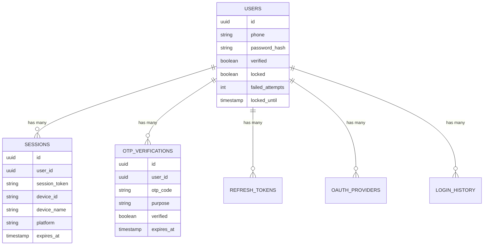
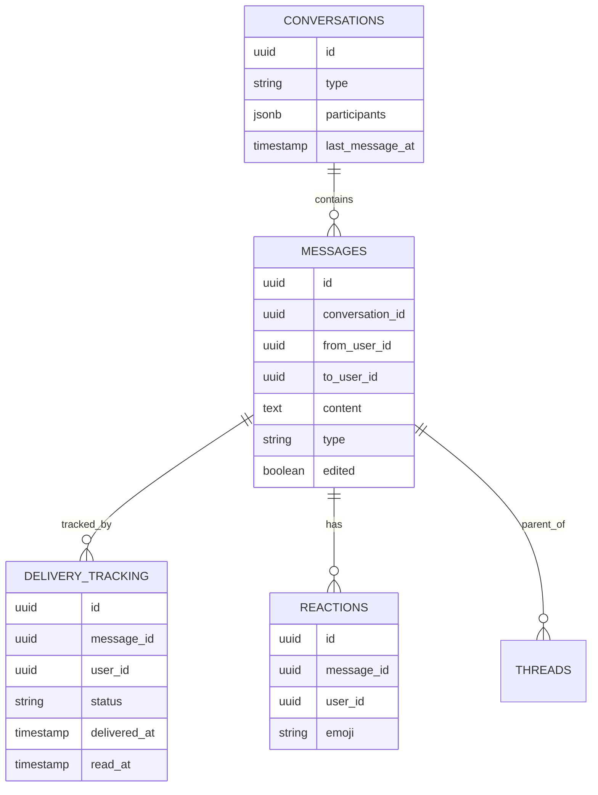

# Database Schema Reference

Complete database schema documentation for Echo Backend PostgreSQL database.

## Table of Contents

- [Overview](#overview)
- [Schema Diagram](#schema-diagram)
- [Auth Schema](#auth-schema)
- [Users Schema](#users-schema)
- [Messages Schema](#messages-schema)
- [Media Schema](#media-schema)
- [Notifications Schema](#notifications-schema)
- [Analytics Schema](#analytics-schema)
- [Location Schema](#location-schema)
- [Common Patterns](#common-patterns)
- [Indexes](#indexes)
- [Triggers](#triggers)

## Overview

The Echo Backend database uses PostgreSQL with a multi-schema design for logical separation of concerns. Each schema corresponds to a microservice domain.

**Database**: `echo`
**PostgreSQL Version**: 15+
**Character Set**: UTF8
**Collation**: en_US.UTF-8

### Schema List

| Schema | Service | Tables | Purpose |
|--------|---------|--------|---------|
| `auth` | Auth Service | 6 | Authentication, sessions, OTP |
| `users` | User Service | 4 | User profiles, contacts |
| `messages` | Message Service | 5 | Messages, conversations |
| `media` | Media Service | 3 | Media files, uploads |
| `notifications` | Notification Service | 3 | Push notifications |
| `analytics` | Analytics Service | 2 | Usage metrics |
| `location` | Location Service | 1 | Phone geolocation |

## Schema Diagram

### Complete Entity Relationship Diagram

```mermaid
erDiagram
    %% Auth Schema
    AUTH_USERS ||--o{ AUTH_SESSIONS : has
    AUTH_USERS ||--o{ AUTH_OTP_VERIFICATIONS : has
    AUTH_USERS ||--o{ AUTH_REFRESH_TOKENS : has
    AUTH_USERS ||--o{ AUTH_OAUTH_PROVIDERS : has
    AUTH_USERS ||--o{ AUTH_LOGIN_HISTORY : has

    %% Users Schema
    AUTH_USERS ||--o| USERS_PROFILES : has
    AUTH_USERS ||--o{ USERS_CONTACTS : has
    AUTH_USERS ||--o{ USERS_BLOCKED_USERS : blocks
    AUTH_USERS ||--o| USERS_PRIVACY_SETTINGS : has

    %% Messages Schema
    AUTH_USERS ||--o{ MESSAGES_CONVERSATIONS : participates
    MESSAGES_CONVERSATIONS ||--o{ MESSAGES_MESSAGES : contains
    MESSAGES_MESSAGES ||--o{ MESSAGES_DELIVERY_TRACKING : tracks
    MESSAGES_MESSAGES ||--o{ MESSAGES_REACTIONS : has
    MESSAGES_MESSAGES ||--o{ MESSAGES_THREADS : replies

    %% Media Schema
    MESSAGES_MESSAGES ||--o{ MEDIA_FILES : contains
    MEDIA_FILES ||--o{ MEDIA_THUMBNAILS : has

    %% Notifications Schema
    AUTH_USERS ||--o{ NOTIFICATIONS_PUSH_TOKENS : has
    AUTH_USERS ||--o| NOTIFICATIONS_PREFERENCES : has

    AUTH_USERS {
        uuid id PK
        string phone UK
        string password_hash
        boolean verified
        boolean locked
        timestamp created_at
        timestamp updated_at
        timestamp deleted_at
    }

    AUTH_SESSIONS {
        uuid id PK
        uuid user_id FK
        string session_token UK
        string device_id
        jsonb device_metadata
        string ip_address
        timestamp expires_at
        timestamp created_at
    }

    MESSAGES_MESSAGES {
        uuid id PK
        uuid conversation_id FK
        uuid from_user_id FK
        uuid to_user_id FK
        text content
        string type
        uuid reply_to_id FK
        boolean edited
        boolean deleted
        jsonb metadata
        timestamp created_at
        timestamp updated_at
        timestamp deleted_at
    }

    USERS_PROFILES {
        uuid user_id PK_FK
        string display_name
        text bio
        string avatar_url
        string status
        timestamp last_seen
        boolean phone_visible
        boolean profile_visible
        timestamp created_at
        timestamp updated_at
    }
```

### Auth Schema Relationships



### Messages Schema Relationships



## Auth Schema

### auth.users

Core user authentication table.

```sql
CREATE TABLE auth.users (
    id UUID PRIMARY KEY DEFAULT gen_random_uuid(),
    phone VARCHAR(20) NOT NULL UNIQUE,
    password_hash VARCHAR(255) NOT NULL,
    verified BOOLEAN DEFAULT FALSE,
    locked BOOLEAN DEFAULT FALSE,
    failed_login_attempts INT DEFAULT 0,
    locked_until TIMESTAMP NULL,
    email VARCHAR(255) NULL UNIQUE,
    email_verified BOOLEAN DEFAULT FALSE,
    created_at TIMESTAMP NOT NULL DEFAULT CURRENT_TIMESTAMP,
    updated_at TIMESTAMP NOT NULL DEFAULT CURRENT_TIMESTAMP,
    deleted_at TIMESTAMP NULL
);

CREATE INDEX idx_users_phone ON auth.users(phone) WHERE deleted_at IS NULL;
CREATE INDEX idx_users_email ON auth.users(email) WHERE email IS NOT NULL AND deleted_at IS NULL;
CREATE INDEX idx_users_verified ON auth.users(verified) WHERE deleted_at IS NULL;
```

**Columns:**

| Column | Type | Constraints | Description |
|--------|------|-------------|-------------|
| id | UUID | PRIMARY KEY | Unique user identifier |
| phone | VARCHAR(20) | NOT NULL, UNIQUE | E.164 format phone number |
| password_hash | VARCHAR(255) | NOT NULL | Argon2id hashed password |
| verified | BOOLEAN | DEFAULT FALSE | Phone verification status |
| locked | BOOLEAN | DEFAULT FALSE | Account lock status |
| failed_login_attempts | INT | DEFAULT 0 | Failed login counter |
| locked_until | TIMESTAMP | NULL | Account unlock time |
| email | VARCHAR(255) | UNIQUE, NULL | Optional email address |
| email_verified | BOOLEAN | DEFAULT FALSE | Email verification status |
| created_at | TIMESTAMP | NOT NULL | Account creation time |
| updated_at | TIMESTAMP | NOT NULL | Last update time |
| deleted_at | TIMESTAMP | NULL | Soft delete timestamp |

---

### auth.sessions

Active user sessions with device information.

```sql
CREATE TABLE auth.sessions (
    id UUID PRIMARY KEY DEFAULT gen_random_uuid(),
    user_id UUID NOT NULL REFERENCES auth.users(id) ON DELETE CASCADE,
    session_token VARCHAR(255) NOT NULL UNIQUE,
    device_id VARCHAR(255) NOT NULL,
    device_name VARCHAR(255) NULL,
    platform VARCHAR(50) NOT NULL,
    device_metadata JSONB DEFAULT '{}'::jsonb,
    ip_address INET NULL,
    user_agent TEXT NULL,
    location JSONB NULL,
    expires_at TIMESTAMP NOT NULL,
    last_activity_at TIMESTAMP NOT NULL DEFAULT CURRENT_TIMESTAMP,
    created_at TIMESTAMP NOT NULL DEFAULT CURRENT_TIMESTAMP
);

CREATE INDEX idx_sessions_user_id ON auth.sessions(user_id);
CREATE INDEX idx_sessions_token ON auth.sessions(session_token);
CREATE INDEX idx_sessions_device_id ON auth.sessions(device_id);
CREATE INDEX idx_sessions_expires_at ON auth.sessions(expires_at);
```

**Columns:**

| Column | Type | Constraints | Description |
|--------|------|-------------|-------------|
| id | UUID | PRIMARY KEY | Session identifier |
| user_id | UUID | FK, NOT NULL | Reference to auth.users |
| session_token | VARCHAR(255) | UNIQUE, NOT NULL | Session token hash |
| device_id | VARCHAR(255) | NOT NULL | Unique device identifier |
| device_name | VARCHAR(255) | NULL | Human-readable device name |
| platform | VARCHAR(50) | NOT NULL | ios, android, web |
| device_metadata | JSONB | DEFAULT '{}' | OS, browser, version info |
| ip_address | INET | NULL | Client IP address |
| user_agent | TEXT | NULL | HTTP User-Agent string |
| location | JSONB | NULL | City, country, timezone |
| expires_at | TIMESTAMP | NOT NULL | Session expiration time |
| last_activity_at | TIMESTAMP | NOT NULL | Last activity timestamp |
| created_at | TIMESTAMP | NOT NULL | Session creation time |

**device_metadata JSONB structure:**
```json
{
  "os": "iOS",
  "os_version": "17.2",
  "browser": "Safari",
  "browser_version": "17.2",
  "device_model": "iPhone 14 Pro",
  "app_version": "1.2.3"
}
```

---

### auth.otp_verifications

OTP codes for phone/email verification.

```sql
CREATE TABLE auth.otp_verifications (
    id UUID PRIMARY KEY DEFAULT gen_random_uuid(),
    user_id UUID NULL REFERENCES auth.users(id) ON DELETE CASCADE,
    phone VARCHAR(20) NULL,
    email VARCHAR(255) NULL,
    otp_code VARCHAR(6) NOT NULL,
    purpose VARCHAR(50) NOT NULL,
    verified BOOLEAN DEFAULT FALSE,
    attempts INT DEFAULT 0,
    expires_at TIMESTAMP NOT NULL,
    verified_at TIMESTAMP NULL,
    created_at TIMESTAMP NOT NULL DEFAULT CURRENT_TIMESTAMP
);

CREATE INDEX idx_otp_user_id ON auth.otp_verifications(user_id);
CREATE INDEX idx_otp_phone ON auth.otp_verifications(phone) WHERE phone IS NOT NULL;
CREATE INDEX idx_otp_email ON auth.otp_verifications(email) WHERE email IS NOT NULL;
CREATE INDEX idx_otp_expires_at ON auth.otp_verifications(expires_at);
```

**Purpose values:**
- `registration` - New user registration
- `login` - Two-factor authentication
- `password_reset` - Password reset verification
- `phone_change` - Phone number change
- `email_verification` - Email verification

---

### auth.refresh_tokens

Refresh tokens for JWT renewal.

```sql
CREATE TABLE auth.refresh_tokens (
    id UUID PRIMARY KEY DEFAULT gen_random_uuid(),
    user_id UUID NOT NULL REFERENCES auth.users(id) ON DELETE CASCADE,
    token VARCHAR(255) NOT NULL UNIQUE,
    device_id VARCHAR(255) NOT NULL,
    expires_at TIMESTAMP NOT NULL,
    revoked BOOLEAN DEFAULT FALSE,
    revoked_at TIMESTAMP NULL,
    created_at TIMESTAMP NOT NULL DEFAULT CURRENT_TIMESTAMP
);

CREATE INDEX idx_refresh_tokens_user_id ON auth.refresh_tokens(user_id);
CREATE INDEX idx_refresh_tokens_token ON auth.refresh_tokens(token);
CREATE INDEX idx_refresh_tokens_expires_at ON auth.refresh_tokens(expires_at);
```

---

### auth.oauth_providers

OAuth provider connections (Google, Apple, etc.).

```sql
CREATE TABLE auth.oauth_providers (
    id UUID PRIMARY KEY DEFAULT gen_random_uuid(),
    user_id UUID NOT NULL REFERENCES auth.users(id) ON DELETE CASCADE,
    provider VARCHAR(50) NOT NULL,
    provider_user_id VARCHAR(255) NOT NULL,
    provider_email VARCHAR(255) NULL,
    access_token TEXT NULL,
    refresh_token TEXT NULL,
    token_expires_at TIMESTAMP NULL,
    profile_data JSONB DEFAULT '{}'::jsonb,
    created_at TIMESTAMP NOT NULL DEFAULT CURRENT_TIMESTAMP,
    updated_at TIMESTAMP NOT NULL DEFAULT CURRENT_TIMESTAMP,
    UNIQUE(provider, provider_user_id)
);

CREATE INDEX idx_oauth_user_id ON auth.oauth_providers(user_id);
CREATE INDEX idx_oauth_provider ON auth.oauth_providers(provider, provider_user_id);
```

**Provider values:**
- `google`
- `apple`
- `facebook`
- `github`

---

### auth.login_history

Login attempt history for security auditing.

```sql
CREATE TABLE auth.login_history (
    id UUID PRIMARY KEY DEFAULT gen_random_uuid(),
    user_id UUID NULL REFERENCES auth.users(id) ON DELETE SET NULL,
    phone VARCHAR(20) NOT NULL,
    success BOOLEAN NOT NULL,
    failure_reason VARCHAR(100) NULL,
    ip_address INET NULL,
    user_agent TEXT NULL,
    device_id VARCHAR(255) NULL,
    location JSONB NULL,
    created_at TIMESTAMP NOT NULL DEFAULT CURRENT_TIMESTAMP
);

CREATE INDEX idx_login_history_user_id ON auth.login_history(user_id);
CREATE INDEX idx_login_history_phone ON auth.login_history(phone);
CREATE INDEX idx_login_history_created_at ON auth.login_history(created_at DESC);
CREATE INDEX idx_login_history_success ON auth.login_history(success);
```

---

## Users Schema

### users.profiles

User profile information.

```sql
CREATE TABLE users.profiles (
    user_id UUID PRIMARY KEY REFERENCES auth.users(id) ON DELETE CASCADE,
    display_name VARCHAR(100) NOT NULL,
    bio TEXT NULL,
    avatar_url TEXT NULL,
    status VARCHAR(50) DEFAULT 'offline',
    last_seen TIMESTAMP NOT NULL DEFAULT CURRENT_TIMESTAMP,
    phone_visible BOOLEAN DEFAULT TRUE,
    profile_visible BOOLEAN DEFAULT TRUE,
    created_at TIMESTAMP NOT NULL DEFAULT CURRENT_TIMESTAMP,
    updated_at TIMESTAMP NOT NULL DEFAULT CURRENT_TIMESTAMP
);

CREATE INDEX idx_profiles_display_name ON users.profiles(display_name);
CREATE INDEX idx_profiles_status ON users.profiles(status);
```

**Status values:**
- `online` - User is active
- `away` - User is idle
- `busy` - Do not disturb mode
- `offline` - User is offline

---

### users.contacts

User contact relationships.

```sql
CREATE TABLE users.contacts (
    id UUID PRIMARY KEY DEFAULT gen_random_uuid(),
    user_id UUID NOT NULL REFERENCES auth.users(id) ON DELETE CASCADE,
    contact_user_id UUID NOT NULL REFERENCES auth.users(id) ON DELETE CASCADE,
    nickname VARCHAR(100) NULL,
    favorite BOOLEAN DEFAULT FALSE,
    blocked BOOLEAN DEFAULT FALSE,
    added_at TIMESTAMP NOT NULL DEFAULT CURRENT_TIMESTAMP,
    UNIQUE(user_id, contact_user_id)
);

CREATE INDEX idx_contacts_user_id ON users.contacts(user_id);
CREATE INDEX idx_contacts_contact_user_id ON users.contacts(contact_user_id);
CREATE INDEX idx_contacts_favorite ON users.contacts(favorite) WHERE favorite = TRUE;
```

---

### users.blocked_users

Blocked users list.

```sql
CREATE TABLE users.blocked_users (
    id UUID PRIMARY KEY DEFAULT gen_random_uuid(),
    user_id UUID NOT NULL REFERENCES auth.users(id) ON DELETE CASCADE,
    blocked_user_id UUID NOT NULL REFERENCES auth.users(id) ON DELETE CASCADE,
    reason VARCHAR(255) NULL,
    blocked_at TIMESTAMP NOT NULL DEFAULT CURRENT_TIMESTAMP,
    UNIQUE(user_id, blocked_user_id)
);

CREATE INDEX idx_blocked_users_user_id ON users.blocked_users(user_id);
CREATE INDEX idx_blocked_users_blocked_user_id ON users.blocked_users(blocked_user_id);
```

---

### users.privacy_settings

User privacy preferences.

```sql
CREATE TABLE users.privacy_settings (
    user_id UUID PRIMARY KEY REFERENCES auth.users(id) ON DELETE CASCADE,
    show_last_seen VARCHAR(20) DEFAULT 'everyone',
    show_profile_photo VARCHAR(20) DEFAULT 'everyone',
    show_status VARCHAR(20) DEFAULT 'everyone',
    show_read_receipts BOOLEAN DEFAULT TRUE,
    show_typing_indicator BOOLEAN DEFAULT TRUE,
    allow_group_invites VARCHAR(20) DEFAULT 'everyone',
    created_at TIMESTAMP NOT NULL DEFAULT CURRENT_TIMESTAMP,
    updated_at TIMESTAMP NOT NULL DEFAULT CURRENT_TIMESTAMP
);
```

**Privacy level values:**
- `everyone` - All users
- `contacts` - Only contacts
- `nobody` - No one

---

## Messages Schema

### messages.conversations

Conversation containers for messages.

```sql
CREATE TABLE messages.conversations (
    id UUID PRIMARY KEY DEFAULT gen_random_uuid(),
    type VARCHAR(20) NOT NULL DEFAULT 'direct',
    name VARCHAR(255) NULL,
    participants JSONB NOT NULL,
    created_by UUID REFERENCES auth.users(id) ON DELETE SET NULL,
    last_message_id UUID NULL,
    last_message_at TIMESTAMP NULL,
    metadata JSONB DEFAULT '{}'::jsonb,
    created_at TIMESTAMP NOT NULL DEFAULT CURRENT_TIMESTAMP,
    updated_at TIMESTAMP NOT NULL DEFAULT CURRENT_TIMESTAMP,
    deleted_at TIMESTAMP NULL
);

CREATE INDEX idx_conversations_type ON messages.conversations(type);
CREATE INDEX idx_conversations_participants ON messages.conversations USING gin(participants);
CREATE INDEX idx_conversations_last_message_at ON messages.conversations(last_message_at DESC);
```

**Type values:**
- `direct` - One-on-one conversation
- `group` - Group chat
- `channel` - Broadcast channel

**participants JSONB structure:**
```json
{
  "user_ids": ["uuid1", "uuid2", "uuid3"],
  "admins": ["uuid1"],
  "muted": ["uuid2"]
}
```

---

### messages.messages

Individual messages.

```sql
CREATE TABLE messages.messages (
    id UUID PRIMARY KEY DEFAULT gen_random_uuid(),
    conversation_id UUID NOT NULL REFERENCES messages.conversations(id) ON DELETE CASCADE,
    from_user_id UUID NOT NULL REFERENCES auth.users(id) ON DELETE CASCADE,
    to_user_id UUID NULL REFERENCES auth.users(id) ON DELETE SET NULL,
    content TEXT NOT NULL,
    type VARCHAR(50) NOT NULL DEFAULT 'text',
    reply_to_id UUID NULL REFERENCES messages.messages(id) ON DELETE SET NULL,
    forwarded_from_id UUID NULL REFERENCES messages.messages(id) ON DELETE SET NULL,
    edited BOOLEAN DEFAULT FALSE,
    deleted BOOLEAN DEFAULT FALSE,
    metadata JSONB DEFAULT '{}'::jsonb,
    created_at TIMESTAMP NOT NULL DEFAULT CURRENT_TIMESTAMP,
    updated_at TIMESTAMP NOT NULL DEFAULT CURRENT_TIMESTAMP,
    deleted_at TIMESTAMP NULL
);

CREATE INDEX idx_messages_conversation_id ON messages.messages(conversation_id, created_at DESC);
CREATE INDEX idx_messages_from_user_id ON messages.messages(from_user_id);
CREATE INDEX idx_messages_to_user_id ON messages.messages(to_user_id);
CREATE INDEX idx_messages_reply_to_id ON messages.messages(reply_to_id) WHERE reply_to_id IS NOT NULL;
CREATE INDEX idx_messages_created_at ON messages.messages(created_at DESC);
```

**Type values:**
- `text` - Plain text message
- `image` - Image with optional caption
- `video` - Video with optional caption
- `audio` - Voice message
- `document` - File attachment
- `location` - GPS coordinates
- `contact` - Shared contact card
- `sticker` - Sticker/emoji
- `poll` - Poll/survey

**metadata JSONB structure (type-specific):**

*For image/video:*
```json
{
  "file_url": "https://cdn.echo.app/...",
  "thumbnail_url": "https://cdn.echo.app/...",
  "width": 1920,
  "height": 1080,
  "size": 2457600,
  "mime_type": "image/jpeg",
  "caption": "Beautiful sunset"
}
```

*For location:*
```json
{
  "latitude": 37.7749,
  "longitude": -122.4194,
  "name": "San Francisco",
  "address": "123 Main St, San Francisco, CA"
}
```

---

### messages.delivery_tracking

Message delivery status per recipient.

```sql
CREATE TABLE messages.delivery_tracking (
    id UUID PRIMARY KEY DEFAULT gen_random_uuid(),
    message_id UUID NOT NULL REFERENCES messages.messages(id) ON DELETE CASCADE,
    user_id UUID NOT NULL REFERENCES auth.users(id) ON DELETE CASCADE,
    status VARCHAR(20) NOT NULL DEFAULT 'sent',
    delivered_at TIMESTAMP NULL,
    read_at TIMESTAMP NULL,
    created_at TIMESTAMP NOT NULL DEFAULT CURRENT_TIMESTAMP,
    UNIQUE(message_id, user_id)
);

CREATE INDEX idx_delivery_tracking_message_id ON messages.delivery_tracking(message_id);
CREATE INDEX idx_delivery_tracking_user_id ON messages.delivery_tracking(user_id);
CREATE INDEX idx_delivery_tracking_status ON messages.delivery_tracking(status);
```

**Status flow:**
```
sent → delivered → read
```

---

### messages.reactions

Emoji reactions to messages.

```sql
CREATE TABLE messages.reactions (
    id UUID PRIMARY KEY DEFAULT gen_random_uuid(),
    message_id UUID NOT NULL REFERENCES messages.messages(id) ON DELETE CASCADE,
    user_id UUID NOT NULL REFERENCES auth.users(id) ON DELETE CASCADE,
    emoji VARCHAR(10) NOT NULL,
    created_at TIMESTAMP NOT NULL DEFAULT CURRENT_TIMESTAMP,
    UNIQUE(message_id, user_id, emoji)
);

CREATE INDEX idx_reactions_message_id ON messages.reactions(message_id);
CREATE INDEX idx_reactions_user_id ON messages.reactions(user_id);
```

---

### messages.threads

Message threads (replies).

```sql
CREATE TABLE messages.threads (
    id UUID PRIMARY KEY DEFAULT gen_random_uuid(),
    parent_message_id UUID NOT NULL REFERENCES messages.messages(id) ON DELETE CASCADE,
    reply_message_id UUID NOT NULL REFERENCES messages.messages(id) ON DELETE CASCADE,
    created_at TIMESTAMP NOT NULL DEFAULT CURRENT_TIMESTAMP,
    UNIQUE(parent_message_id, reply_message_id)
);

CREATE INDEX idx_threads_parent_message_id ON messages.threads(parent_message_id);
CREATE INDEX idx_threads_reply_message_id ON messages.threads(reply_message_id);
```

---

## Media Schema

### media.files

Uploaded media files.

```sql
CREATE TABLE media.files (
    id UUID PRIMARY KEY DEFAULT gen_random_uuid(),
    user_id UUID NOT NULL REFERENCES auth.users(id) ON DELETE CASCADE,
    message_id UUID NULL REFERENCES messages.messages(id) ON DELETE SET NULL,
    file_name VARCHAR(255) NOT NULL,
    file_type VARCHAR(100) NOT NULL,
    file_size BIGINT NOT NULL,
    mime_type VARCHAR(100) NOT NULL,
    storage_path TEXT NOT NULL,
    url TEXT NOT NULL,
    width INT NULL,
    height INT NULL,
    duration INT NULL,
    checksum VARCHAR(64) NOT NULL,
    metadata JSONB DEFAULT '{}'::jsonb,
    created_at TIMESTAMP NOT NULL DEFAULT CURRENT_TIMESTAMP,
    deleted_at TIMESTAMP NULL
);

CREATE INDEX idx_media_files_user_id ON media.files(user_id);
CREATE INDEX idx_media_files_message_id ON media.files(message_id);
CREATE INDEX idx_media_files_file_type ON media.files(file_type);
CREATE INDEX idx_media_files_created_at ON media.files(created_at DESC);
```

---

## Notifications Schema

### notifications.push_tokens

FCM/APNS push notification tokens.

```sql
CREATE TABLE notifications.push_tokens (
    id UUID PRIMARY KEY DEFAULT gen_random_uuid(),
    user_id UUID NOT NULL REFERENCES auth.users(id) ON DELETE CASCADE,
    device_id VARCHAR(255) NOT NULL,
    platform VARCHAR(50) NOT NULL,
    token TEXT NOT NULL,
    active BOOLEAN DEFAULT TRUE,
    last_used_at TIMESTAMP NOT NULL DEFAULT CURRENT_TIMESTAMP,
    created_at TIMESTAMP NOT NULL DEFAULT CURRENT_TIMESTAMP,
    UNIQUE(device_id, platform)
);

CREATE INDEX idx_push_tokens_user_id ON notifications.push_tokens(user_id);
CREATE INDEX idx_push_tokens_active ON notifications.push_tokens(active) WHERE active = TRUE;
```

---

## Location Schema

### location.phone_locations

Phone number to location mapping.

```sql
CREATE TABLE location.phone_locations (
    id UUID PRIMARY KEY DEFAULT gen_random_uuid(),
    country_code VARCHAR(5) NOT NULL,
    country VARCHAR(100) NOT NULL,
    country_name VARCHAR(255) NOT NULL,
    region VARCHAR(255) NULL,
    timezone VARCHAR(100) NULL,
    carrier VARCHAR(255) NULL,
    created_at TIMESTAMP NOT NULL DEFAULT CURRENT_TIMESTAMP,
    updated_at TIMESTAMP NOT NULL DEFAULT CURRENT_TIMESTAMP
);

CREATE INDEX idx_phone_locations_country_code ON location.phone_locations(country_code);
```

---

## Common Patterns

### UUID Primary Keys

All tables use UUID v4 for primary keys:
```sql
id UUID PRIMARY KEY DEFAULT gen_random_uuid()
```

### Soft Deletes

Most tables support soft deletes:
```sql
deleted_at TIMESTAMP NULL
```

Query only non-deleted records:
```sql
SELECT * FROM table_name WHERE deleted_at IS NULL;
```

### Timestamps

All tables have automatic timestamps:
```sql
created_at TIMESTAMP NOT NULL DEFAULT CURRENT_TIMESTAMP,
updated_at TIMESTAMP NOT NULL DEFAULT CURRENT_TIMESTAMP
```

### JSONB Metadata

Flexible metadata storage:
```sql
metadata JSONB DEFAULT '{}'::jsonb
```

### Foreign Key Cascades

Standard cascade rules:
- `ON DELETE CASCADE` - Delete child records
- `ON DELETE SET NULL` - Nullify reference
- `ON DELETE RESTRICT` - Prevent deletion (default)

---

## Indexes

### Index Strategy

**Primary Indexes:**
- All primary keys (automatic)
- All foreign keys
- Unique constraints

**Search Indexes:**
- Phone numbers
- Email addresses
- Session tokens

**Range Indexes:**
- Timestamps (created_at, updated_at, expires_at)
- Status columns

**Partial Indexes:**
- WHERE deleted_at IS NULL (soft deletes)
- WHERE active = TRUE (active records)

**GIN Indexes:**
- JSONB columns (participants, metadata)

---

## Triggers

### Update Timestamp Trigger

Automatically update `updated_at` on row modifications:

```sql
CREATE OR REPLACE FUNCTION update_updated_at_column()
RETURNS TRIGGER AS $$
BEGIN
    NEW.updated_at = CURRENT_TIMESTAMP;
    RETURN NEW;
END;
$$ LANGUAGE plpgsql;

-- Apply to all tables
CREATE TRIGGER update_users_updated_at
    BEFORE UPDATE ON auth.users
    FOR EACH ROW
    EXECUTE FUNCTION update_updated_at_column();
```

### Session Cleanup Trigger

Delete expired sessions:

```sql
CREATE OR REPLACE FUNCTION cleanup_expired_sessions()
RETURNS void AS $$
BEGIN
    DELETE FROM auth.sessions
    WHERE expires_at < CURRENT_TIMESTAMP;
END;
$$ LANGUAGE plpgsql;

-- Run periodically via pg_cron or app scheduler
```

---

**Last Updated**: January 2025
**Version**: 1.0.0
