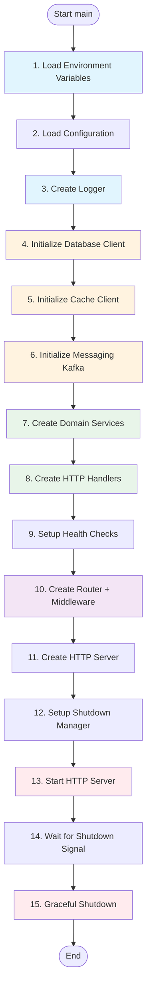
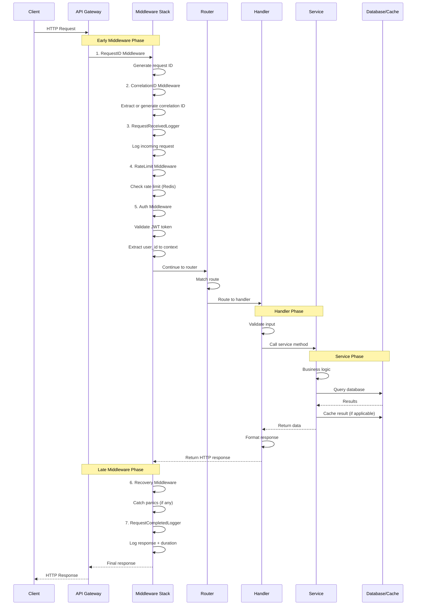

# Server Architecture Deep Dive

Comprehensive guide to how servers are structured, initialized, and handle requests in Echo Backend.

## Table of Contents

- [Service Ports](#service-ports)
- [Server Initialization Flow](#server-initialization-flow)
- [Request Lifecycle](#request-lifecycle)
- [Middleware Architecture](#middleware-architecture)
- [Router Architecture](#router-architecture)
- [Service Layer Patterns](#service-layer-patterns)
- [Creating a New Service](#creating-a-new-service)

## Service Ports

All services run on different ports to allow simultaneous development and testing.

### Service Port Mapping

| Service | Port | Protocol | Public Access | Purpose |
|---------|------|----------|---------------|---------|
| **API Gateway** | 8080 | HTTP/HTTPS | Yes | Main entry point for clients |
| **Auth Service** | 8081 | HTTP | No | Authentication & authorization |
| **User Service** | 8082 | HTTP | No | User profile management |
| **Message Service** | 8083 | HTTP/WS | No | Real-time messaging + WebSocket |
| **Presence Service** | 8084 | HTTP | No | Online status tracking |
| **Media Service** | 8085 | HTTP | No | Media file handling |
| **Notification Service** | 8086 | HTTP | No | Push notifications |
| **Analytics Service** | 8087 | HTTP | No | Usage analytics |
| **Location Service** | 8090 | HTTP | Yes | Phone geolocation |

### Infrastructure Ports

| Service | Port | Protocol | Purpose |
|---------|------|----------|---------|
| PostgreSQL | 5432 | TCP | Database |
| Redis | 6379 | TCP | Cache & sessions |
| Kafka | 9092, 9093 | TCP | Message queue |
| Zookeeper | 2181 | TCP | Kafka coordination |

### Port Configuration

Ports are configured via environment variables with fallback defaults:

```yaml
# services/<service>/configs/config.yaml
server:
  port: ${SERVER_PORT:8081}  # Default: 8081
  host: ${SERVER_HOST:0.0.0.0}
```

```bash
# .env or docker-compose.yml
SERVER_PORT=8081
```

## Server Initialization Flow

All services follow a standardized initialization pattern. Understanding this flow is critical for adding new services.

### Complete Initialization Sequence



### Step-by-Step Breakdown

#### 1. Load Environment Variables

```go
// cmd/server/main.go
func main() {
    env.LoadEnv()  // Loads from .env file or environment
    // ...
}
```

**What it does:**
- Loads `.env` file if present
- Makes environment variables available via `os.Getenv()`
- Sets default values for missing variables

#### 2. Load Configuration

```go
func loadConfig() (*config.Config, error) {
    configLogger := createLogger("config-loader")
    defer configLogger.Sync()

    configPath := env.GetEnv("CONFIG_PATH", "configs/config.yaml")
    appEnv := env.GetEnv("APP_ENV", "development")

    // Load base config + environment-specific overrides
    cfg, err := config.Load(configPath, appEnv)
    if err != nil {
        return nil, err
    }

    // Validate and set defaults
    if err := config.ValidateAndSetDefaults(cfg); err != nil {
        return nil, err
    }

    return cfg, nil
}
```

**Config loading strategy:**
1. Load `config.yaml` (base configuration)
2. Overlay `config.dev.yaml` or `config.prod.yaml` (env-specific)
3. Interpolate environment variables: `${DB_HOST:localhost}`
4. Validate required fields
5. Set defaults for optional fields

#### 3. Create Structured Logger

```go
func createLogger(name string) logger.Logger {
    log, err := adapter.NewZap(logger.Config{
        Level:      logger.GetLoggerLevel(),        // From LOG_LEVEL env
        Format:     logger.GetLoggerFormat(),       // json or console
        Output:     logger.GetLoggerOutput(),       // stdout or file
        TimeFormat: logger.GetLoggerTimeFormat(),   // ISO8601
        Service:    name,
    })
    if err != nil {
        panic(fmt.Sprintf("Failed to create logger: %v", err))
    }
    return log
}
```

**Logger features:**
- Structured JSON logging (production)
- Console logging with colors (development)
- Log levels: debug, info, warn, error, fatal
- Context fields: service, request_id, correlation_id

#### 4. Initialize Database Client

```go
func createDBClient(cfg config.DatabaseConfig, log logger.Logger) (database.Database, error) {
    dbClient, err := postgres.New(database.Config{
        Host:            cfg.Host,
        Port:            cfg.Port,
        User:            cfg.User,
        Password:        cfg.Password,
        Database:        cfg.DBName,
        SSLMode:         cfg.SSLMode,
        MaxOpenConns:    cfg.MaxOpenConns,      // Default: 25
        MaxIdleConns:    cfg.MaxIdleConns,      // Default: 10
        ConnMaxLifetime: cfg.ConnMaxLifetime,   // Default: 5m
        ConnMaxIdleTime: cfg.ConnMaxIdleTime,   // Default: 10m
    })
    if err != nil {
        return nil, err
    }

    // Test connection
    if err := dbClient.Ping(context.Background()); err != nil {
        return nil, fmt.Errorf("database ping failed: %w", err)
    }

    log.Info("Database client created successfully")
    return dbClient, nil
}
```

**Important:**
- Always `defer dbClient.Close()` after creation
- Connection pooling is automatic
- Ping validates connectivity

#### 5. Initialize Cache Client (Optional)

```go
func createCacheClient(cfg config.CacheConfig, log logger.Logger) (cache.Cache, error) {
    cacheClient, err := redis.New(cache.Config{
        Host:         cfg.Host,
        Port:         cfg.Port,
        Password:     cfg.Password,
        DB:           cfg.DB,
        MaxRetries:   cfg.MaxRetries,
        PoolSize:     cfg.PoolSize,
        MinIdleConns: cfg.MinIdleConns,
        DialTimeout:  cfg.DialTimeout,
    })
    if err != nil {
        return nil, err
    }

    log.Info("Cache client created successfully")
    return cacheClient, nil
}
```

**Cache is optional:**
```go
var cacheClient cache.Cache
if cfg.Cache.Enabled {
    cacheClient, err = createCacheClient(cfg.Cache, log)
    // ...
    defer cacheClient.Close()
}
```

#### 6. Initialize Messaging (Kafka) - If Needed

```go
func createKafkaProducer(cfg config.KafkaConfig, log logger.Logger) (messaging.Producer, error) {
    producer, err := kafka.NewProducer(messaging.Config{
        Brokers:    cfg.Brokers,           // ["localhost:9092"]
        ClientID:   "message-service",
        MaxRetries: 3,
    })
    if err != nil {
        return nil, err
    }

    log.Info("Kafka producer created successfully")
    return producer, nil
}
```

**Only needed for:**
- Message Service (producer)
- Notification Service (consumer)
- Analytics Service (consumer)

#### 7. Create Domain Services (Builder Pattern)

```go
// Create repositories
authRepo := repository.NewAuthRepository(dbClient, log)
sessionRepo := repository.NewSessionRepo(dbClient, log)
loginHistoryRepo := repository.NewLoginHistoryRepo(dbClient, log)

// Create helper services
tokenService := createTokenManager(*cfg, log)
hashingService := createHashingService(*cfg, log)
locationService := service.NewLocationService(cfg.LocationService.Endpoint, log)

// Build main service using Builder pattern
authService := service.NewAuthServiceBuilder().
    WithRepo(authRepo).
    WithLoginHistoryRepo(loginHistoryRepo).
    WithTokenService(*tokenService).
    WithHashingService(*hashingService).
    WithCache(cacheClient).
    WithConfig(&cfg.Auth).
    WithLogger(log).
    Build()  // Validates all required dependencies
```

**Builder Pattern Benefits:**
- Explicit dependency declaration
- Compile-time safety
- Validates required fields at startup (fails fast)
- Clear initialization flow

#### 8. Create HTTP Handlers

```go
authHandler := handler.NewAuthHandler(
    authService,
    sessionService,
    locationService,
    log,
)
```

**Handler Responsibilities:**
- HTTP request/response handling
- Input validation
- Call service layer
- Return standardized responses

#### 9. Setup Health Checks

```go
func setupHealthChecks(
    dbClient database.Database,
    cacheClient cache.Cache,
    cfg *config.Config,
) *health.Manager {
    healthMgr := health.NewManager(cfg.Service.Name, cfg.Service.Version)

    // Register database checker
    if dbClient != nil {
        healthMgr.RegisterChecker(checkers.NewDatabaseChecker(dbClient))
    }

    // Register cache checker
    if cacheClient != nil && cfg.Cache.Enabled {
        healthMgr.RegisterChecker(checkers.NewCacheChecker(cacheClient))
        healthMgr.RegisterChecker(checkers.NewCachePerformanceChecker(cacheClient))
    }

    return healthMgr
}
```

**Health Check Endpoints:**
- `/health` - Liveness (always returns 200)
- `/ready` - Readiness (checks dependencies)

#### 10. Create Router + Middleware

```go
func createRouter(
    authHandler *handler.AuthHandler,
    healthHandler *health.Handler,
    log logger.Logger,
) (*router.Router, error) {
    builder := router.NewBuilder().
        // System endpoints
        WithHealthEndpoint("/health", healthHandler.Health).

        // Custom error handlers
        WithNotFoundHandler(func(w http.ResponseWriter, r *http.Request) {
            response.RouteNotFoundError(r.Context(), r, w, log)
        }).
        WithMethodNotAllowedHandler(func(w http.ResponseWriter, r *http.Request) {
            response.MethodNotAllowedError(r.Context(), r, w)
        }).

        // Early middleware (before routing)
        WithEarlyMiddleware(
            router.Middleware(middleware.RequestID()),
            router.Middleware(middleware.CorrelationID()),
            router.Middleware(middleware.RequestReceivedLogger(log)),
            router.Middleware(middleware.RateLimit(config)),
        ).

        // Late middleware (after routing)
        WithLateMiddleware(
            router.Middleware(middleware.Recovery(log)),
            router.Middleware(middleware.RequestCompletedLogger(log)),
        )

    // Register application routes
    builder = builder.WithRoutes(func(r *router.Router) {
        r.Post("/register", authHandler.Register)
        r.Post("/login", authHandler.Login)
        r.Post("/logout", authHandler.Logout)
    })

    return builder.Build(), nil
}
```

**Middleware Execution Order:**
```
Request →
  Early Middleware (RequestID, Logger, RateLimit, Auth) →
    Route Matching →
      Late Middleware (Recovery, CompletedLogger) →
        Handler →
      Late Middleware Response →
    Route Response →
  Early Middleware Response →
Response
```

#### 11. Create HTTP Server

```go
serverCfg := &server.Config{
    Host:            cfg.Server.Host,             // 0.0.0.0
    Port:            cfg.Server.Port,             // 8081
    ReadTimeout:     cfg.Server.ReadTimeout,      // 30s
    WriteTimeout:    cfg.Server.WriteTimeout,     // 30s
    IdleTimeout:     cfg.Server.IdleTimeout,      // 60s
    ShutdownTimeout: cfg.Server.ShutdownTimeout,  // 30s
    MaxHeaderBytes:  cfg.Server.MaxHeaderBytes,   // 1MB
    Handler:         routerInstance.Mux(),        // Gorilla mux
}

// Optional TLS
if cfg.Server.TLSEnabled {
    serverCfg.TLSEnabled = true
    serverCfg.TLSCertFile = cfg.Server.TLSCertFile
    serverCfg.TLSKeyFile = cfg.Server.TLSKeyFile
}

srv, err := server.New(serverCfg, log)
if err != nil {
    log.Fatal("Failed to create server", logger.Error(err))
}
```

#### 12. Setup Graceful Shutdown

```go
func setupShutdownManager(
    srv *server.Server,
    log logger.Logger,
    cfg *config.Config,
) *shutdown.Manager {
    shutdownMgr := shutdown.New(
        shutdown.WithTimeout(cfg.Server.ShutdownTimeout),  // 30s
        shutdown.WithLogger(log),
    )

    // Priority: High (100) - Stop accepting requests first
    shutdownMgr.RegisterWithPriority(
        "http-server",
        shutdown.ServerShutdownHook(srv),
        shutdown.PriorityHigh,
    )

    // Priority: High (100) - Drain existing connections
    if cfg.Shutdown.WaitForConnections && cfg.Shutdown.DrainTimeout > 0 {
        shutdownMgr.RegisterWithOptions(
            "drain-connections",
            shutdown.DelayHook(cfg.Shutdown.DrainTimeout),
            shutdown.PriorityHigh,
            cfg.Shutdown.DrainTimeout,
        )
    }

    // Priority: Normal (50) - Close database connections
    shutdownMgr.RegisterWithPriority(
        "database",
        shutdown.Hook(func(ctx context.Context) error {
            return dbClient.Close()
        }),
        shutdown.PriorityNormal,
    )

    // Priority: Low (10) - Sync logs
    shutdownMgr.RegisterWithPriority(
        "logger-sync",
        shutdown.Hook(func(ctx context.Context) error {
            return log.Sync()
        }),
        shutdown.PriorityLow,
    )

    return shutdownMgr
}
```

**Shutdown Priorities:**
- **High (100)**: HTTP server, connection draining
- **Normal (50)**: Database, cache, Kafka
- **Low (10)**: Logger sync, cleanup

#### 13. Start HTTP Server

```go
serverErrors := make(chan error, 1)
go func() {
    log.Info("Starting Auth Service server",
        logger.String("host", cfg.Server.Host),
        logger.Int("port", cfg.Server.Port),
    )
    serverErrors <- srv.Start()  // Blocking call
}()
```

#### 14. Wait for Shutdown Signal

```go
select {
case err := <-serverErrors:
    // Server error (unexpected)
    if err != nil && !errors.Is(err, http.ErrServerClosed) {
        log.Fatal("Server error", logger.Error(err))
    }
    log.Info("Server stopped")

case <-waitForShutdown(shutdownMgr):
    // Graceful shutdown (SIGTERM/SIGINT)
    log.Info("Auth Service stopped gracefully")
}
```

**Shutdown signals:**
- `SIGTERM` - Docker stop, Kubernetes
- `SIGINT` - Ctrl+C

## Request Lifecycle

### Complete Request Flow



### Detailed Middleware Execution

**Early Middleware (Before Route Matching):**

1. **RequestID**: Generate unique ID for tracing
   ```go
   request_id: "req_abc123"
   ```

2. **CorrelationID**: Extract from header or generate
   ```go
   X-Correlation-ID: "corr_xyz789"
   ```

3. **RequestReceivedLogger**: Log incoming request
   ```json
   {
     "level": "info",
     "message": "Request received",
     "method": "POST",
     "path": "/login",
     "request_id": "req_abc123"
   }
   ```

4. **RateLimit**: Check request quota
   ```go
   // Fixed window, sliding window, or token bucket
   if exceeded {
       return 429 Too Many Requests
   }
   ```

5. **Auth**: Validate JWT and extract user
   ```go
   // Skip for public paths: /health, /register, /login
   if !isPublicPath {
       claims := validateJWT(token)
       ctx = context.WithValue(ctx, "user_id", claims.Subject)
   }
   ```

**Late Middleware (After Route Matching):**

6. **Recovery**: Catch panics
   ```go
   defer func() {
       if r := recover(); r != nil {
           log.Error("Panic recovered", logger.Any("panic", r))
           return 500 Internal Server Error
       }
   }()
   ```

7. **RequestCompletedLogger**: Log completion
   ```json
   {
     "level": "info",
     "message": "Request completed",
     "method": "POST",
     "path": "/login",
     "status": 200,
     "duration_ms": 45,
     "request_id": "req_abc123"
   }
   ```

## Middleware Architecture

### Middleware Interface

```go
// Middleware signature
type Handler func(http.Handler) http.Handler

// Example middleware
func RequestID() Handler {
    return func(next http.Handler) http.Handler {
        return http.HandlerFunc(func(w http.ResponseWriter, r *http.Request) {
            // Before handler
            requestID := generateRequestID()
            ctx := context.WithValue(r.Context(), "request_id", requestID)
            r = r.WithContext(ctx)
            w.Header().Set("X-Request-ID", requestID)

            // Call next handler
            next.ServeHTTP(w, r)

            // After handler (if needed)
        })
    }
}
```

### Available Middleware

#### Core Middleware

| Middleware | Purpose | Phase | Config Required |
|------------|---------|-------|-----------------|
| RequestID | Generate request ID | Early | No |
| CorrelationID | Extract/generate correlation ID | Early | No |
| RequestReceivedLogger | Log incoming request | Early | Logger |
| RequestCompletedLogger | Log response + duration | Late | Logger |
| Recovery | Catch panics | Late | Logger |

#### Auth & Security

| Middleware | Purpose | Phase | Config Required |
|------------|---------|-------|-----------------|
| Auth | JWT validation | Early | Token service, skip paths |
| APIKey | API key validation | Early | Key store |
| SecurityHeaders | Add security headers | Early | Header config |
| CORS | Handle CORS | Early | Origins, methods |

#### Rate Limiting

| Middleware | Purpose | Phase | Config Required |
|------------|---------|-------|-----------------|
| FixedWindowRateLimit | Fixed window strategy | Early | Requests, window |
| SlidingWindowRateLimit | Sliding window strategy | Early | Requests, window |
| TokenBucketRateLimit | Token bucket strategy | Early | Capacity, refill rate |

#### Request Processing

| Middleware | Purpose | Phase | Config Required |
|------------|---------|-------|-----------------|
| Timeout | Request timeout | Early | Timeout duration |
| BodyLimit | Limit request body size | Early | Max size |
| Compression | Gzip compression | Late | Level, min size |
| CacheControl | Cache headers | Late | Max age |

### Middleware Configuration Example

```go
// API Gateway middleware stack
builder := router.NewBuilder().
    WithEarlyMiddleware(
        // Request identification
        router.Middleware(middleware.RequestID()),
        router.Middleware(middleware.CorrelationID()),

        // Logging
        router.Middleware(middleware.RequestReceivedLogger(log)),

        // Security
        router.Middleware(middleware.SecurityHeaders(securityConfig)),
        router.Middleware(middleware.CORS(allowedOrigins, allowedMethods)),

        // Rate limiting
        router.Middleware(middleware.TokenBucketRateLimit(100, time.Minute)),

        // Authentication
        router.Middleware(middleware.Auth(authConfig)),

        // Request constraints
        router.Middleware(middleware.Timeout(30 * time.Second)),
        router.Middleware(middleware.BodyLimit(10 * 1024 * 1024)), // 10MB
    ).
    WithLateMiddleware(
        // Error handling
        router.Middleware(middleware.Recovery(log)),

        // Response processing
        router.Middleware(middleware.Compression(compressionConfig)),
        router.Middleware(middleware.CacheControl(3600)),

        // Final logging
        router.Middleware(middleware.RequestCompletedLogger(log)),
    )
```

## Router Architecture

### Router Builder Pattern

```go
builder := router.NewBuilder()

// 1. System endpoints
builder = builder.
    WithHealthEndpoint("/health", healthHandler.Health).
    WithMetricsEndpoint("/metrics", metricsHandler).
    WithVersionEndpoint("/version", versionHandler)

// 2. Error handlers
builder = builder.
    WithNotFoundHandler(notFoundHandler).
    WithMethodNotAllowedHandler(methodNotAllowedHandler)

// 3. Middleware
builder = builder.
    WithEarlyMiddleware(middleware1, middleware2).
    WithLateMiddleware(middleware3, middleware4)

// 4. Routes
builder = builder.WithRoutes(func(r *router.Router) {
    r.Get("/users", userHandler.List)
    r.Post("/users", userHandler.Create)
    r.Get("/users/{id}", userHandler.Get)
    r.Put("/users/{id}", userHandler.Update)
    r.Delete("/users/{id}", userHandler.Delete)
})

// 5. Route groups
builder = builder.WithRoutesGroup("/api/v1", func(rg *router.RouteGroup) {
    rg.Get("/profile", profileHandler.Get)
    rg.Put("/profile", profileHandler.Update)
})

// 6. Build
router := builder.Build()
```

### Route Methods

```go
// HTTP methods
r.Get(path, handler)
r.Post(path, handler)
r.Put(path, handler)
r.Delete(path, handler)
r.Patch(path, handler)
r.Options(path, handler)
r.Head(path, handler)

// Path parameters
r.Get("/users/{id}", handler)          // Single param
r.Get("/users/{id}/posts/{post_id}", handler)  // Multiple params

// Accessing path parameters in handler
func (h *Handler) GetUser(w http.ResponseWriter, r *http.Request) {
    userID := router.Param(r, "id")
    // ...
}
```

## Service Layer Patterns

### Repository → Service → Handler

```
Handler (HTTP layer)
   ↓ calls
Service (Business logic)
   ↓ calls
Repository (Data access)
   ↓ calls
Database
```

**Example:**

```go
// Repository (data access)
type AuthRepository interface {
    CreateUser(ctx context.Context, user *model.User) error
    FindUserByPhone(ctx context.Context, phone string) (*model.User, error)
}

// Service (business logic)
type AuthService struct {
    repo           AuthRepository
    tokenService   TokenService
    hashingService HashingService
    logger         logger.Logger
}

func (s *AuthService) Register(ctx context.Context, req RegisterRequest) (*RegisterResponse, error) {
    // 1. Validate input
    if err := req.Validate(); err != nil {
        return nil, err
    }

    // 2. Check if user exists
    existing, _ := s.repo.FindUserByPhone(ctx, req.Phone)
    if existing != nil {
        return nil, ErrPhoneAlreadyExists
    }

    // 3. Hash password
    passwordHash, err := s.hashingService.Hash(req.Password)
    if err != nil {
        return nil, err
    }

    // 4. Create user
    user := &model.User{
        ID:           uuid.New(),
        Phone:        req.Phone,
        PasswordHash: passwordHash,
    }
    if err := s.repo.CreateUser(ctx, user); err != nil {
        return nil, err
    }

    // 5. Generate OTP
    otp := generateOTP()
    // ... save OTP to database

    return &RegisterResponse{
        UserID:   user.ID,
        OTPSent:  true,
    }, nil
}

// Handler (HTTP layer)
func (h *AuthHandler) Register(w http.ResponseWriter, r *http.Request) {
    var req RegisterRequest
    if err := json.NewDecoder(r.Body).Decode(&req); err != nil {
        response.BadRequest(w, "INVALID_JSON", err.Error())
        return
    }

    resp, err := h.service.Register(r.Context(), req)
    if err != nil {
        h.handleError(w, r, err)
        return
    }

    response.Created(w, resp)
}
```

## Creating a New Service

### Checklist

Before writing any code, ensure you have:

- [ ] Service name and purpose defined
- [ ] Port number assigned (see [Service Ports](#service-ports))
- [ ] Database schema designed (if needed)
- [ ] API endpoints planned
- [ ] Dependencies identified (DB, cache, Kafka, etc.)

### Step-by-Step Guide

**1. Create Service Directory Structure**

```bash
mkdir -p services/notification-service/{cmd/server,internal/{config,handler,service,repo,model,health/checkers},configs,api/v1}
```

**2. Create `go.mod`**

```bash
cd services/notification-service
go mod init echo-backend/services/notification-service
```

**3. Create Configuration (`internal/config/config.go`)**

```go
package config

import "time"

type Config struct {
    Service       ServiceConfig       `mapstructure:"service"`
    Server        ServerConfig        `mapstructure:"server"`
    Database      DatabaseConfig      `mapstructure:"database"`
    Cache         CacheConfig         `mapstructure:"cache"`
    Shutdown      ShutdownConfig      `mapstructure:"shutdown"`
}

type ServiceConfig struct {
    Name        string `mapstructure:"name"`
    Version     string `mapstructure:"version"`
    Environment string `mapstructure:"environment"`
}

type ServerConfig struct {
    Host            string        `mapstructure:"host"`
    Port            int           `mapstructure:"port"`
    ReadTimeout     time.Duration `mapstructure:"read_timeout"`
    WriteTimeout    time.Duration `mapstructure:"write_timeout"`
    IdleTimeout     time.Duration `mapstructure:"idle_timeout"`
    ShutdownTimeout time.Duration `mapstructure:"shutdown_timeout"`
    MaxHeaderBytes  int           `mapstructure:"max_header_bytes"`
}

// ... other configs
```

**4. Create `config.yaml`**

```yaml
service:
  name: notification-service
  version: 1.0.0
  environment: ${APP_ENV:development}

server:
  host: ${SERVER_HOST:0.0.0.0}
  port: ${SERVER_PORT:8086}
  read_timeout: ${SERVER_READ_TIMEOUT:30s}
  write_timeout: ${SERVER_WRITE_TIMEOUT:30s}
  idle_timeout: ${SERVER_IDLE_TIMEOUT:60s}
  shutdown_timeout: ${SERVER_SHUTDOWN_TIMEOUT:30s}

database:
  host: ${DB_HOST:localhost}
  port: ${DB_PORT:5432}
  # ... etc
```

**5. Create Model (`internal/model/push_token.go`)**

```go
package model

import (
    "time"
    "github.com/google/uuid"
)

type PushToken struct {
    ID          uuid.UUID  `db:"id" json:"id"`
    UserID      uuid.UUID  `db:"user_id" json:"user_id"`
    DeviceID    string     `db:"device_id" json:"device_id"`
    Platform    string     `db:"platform" json:"platform"`
    Token       string     `db:"token" json:"token"`
    Active      bool       `db:"active" json:"active"`
    CreatedAt   time.Time  `db:"created_at" json:"created_at"`
    UpdatedAt   time.Time  `db:"updated_at" json:"updated_at"`
}

func (p *PushToken) TableName() string {
    return "notifications.push_tokens"
}

func (p *PushToken) PrimaryKey() string {
    return "id"
}
```

**6. Create Repository (`internal/repo/push_token.go`)**

```go
package repo

import (
    "context"
    "notification-service/internal/model"
    "shared/pkg/database"
    "shared/pkg/logger"
)

type PushTokenRepository interface {
    Create(ctx context.Context, token *model.PushToken) error
    FindByUserID(ctx context.Context, userID string) ([]*model.PushToken, error)
    Delete(ctx context.Context, id string) error
}

type pushTokenRepo struct {
    db  database.Database
    log logger.Logger
}

func NewPushTokenRepository(db database.Database, log logger.Logger) PushTokenRepository {
    return &pushTokenRepo{db: db, log: log}
}

func (r *pushTokenRepo) Create(ctx context.Context, token *model.PushToken) error {
    return r.db.Create(ctx, token)
}

func (r *pushTokenRepo) FindByUserID(ctx context.Context, userID string) ([]*model.PushToken, error) {
    query := `SELECT * FROM notifications.push_tokens WHERE user_id = $1 AND active = true`
    tokens := []*model.PushToken{}
    err := r.db.FindMany(ctx, &tokens, query, userID)
    return tokens, err
}
```

**7. Create Service with Builder (`internal/service/notification.go`)**

```go
package service

import (
    "context"
    "notification-service/internal/repo"
    "shared/pkg/logger"
)

type NotificationService struct {
    pushTokenRepo repo.PushTokenRepository
    logger        logger.Logger
}

type NotificationServiceBuilder struct {
    pushTokenRepo repo.PushTokenRepository
    logger        logger.Logger
}

func NewNotificationServiceBuilder() *NotificationServiceBuilder {
    return &NotificationServiceBuilder{}
}

func (b *NotificationServiceBuilder) WithPushTokenRepo(repo repo.PushTokenRepository) *NotificationServiceBuilder {
    b.pushTokenRepo = repo
    return b
}

func (b *NotificationServiceBuilder) WithLogger(logger logger.Logger) *NotificationServiceBuilder {
    b.logger = logger
    return b
}

func (b *NotificationServiceBuilder) Build() *NotificationService {
    if b.pushTokenRepo == nil {
        panic("PushTokenRepository is required")
    }
    if b.logger == nil {
        panic("Logger is required")
    }

    return &NotificationService{
        pushTokenRepo: b.pushTokenRepo,
        logger:        b.logger,
    }
}
```

**8. Create Handler (`internal/handler/notification.go`)**

```go
package handler

import (
    "net/http"
    "notification-service/internal/service"
    "shared/pkg/logger"
    "shared/server/response"
)

type NotificationHandler struct {
    service *service.NotificationService
    logger  logger.Logger
}

func NewNotificationHandler(service *service.NotificationService, logger logger.Logger) *NotificationHandler {
    return &NotificationHandler{
        service: service,
        logger:  logger,
    }
}

func (h *NotificationHandler) RegisterToken(w http.ResponseWriter, r *http.Request) {
    // Implementation
}
```

**9. Create `main.go` (Follow standard pattern from auth-service)**

Copy `auth-service/cmd/server/main.go` and adapt:
- Change import paths
- Update service creation
- Adjust dependencies (remove what's not needed, add what is)

**10. Create Dockerfile & Dockerfile.dev**

**11. Add to `docker-compose.dev.yml`**

**12. Add to `go.work`**

```bash
cd /Users/pratik/Desktop/Projects/echo-backend
go work use ./services/notification-service
```

**13. Create Database Schema**

```bash
mkdir -p database/schemas/notifications
# Create migration files
```

**14. Update API Gateway Routes (if public)**

**15. Add Makefile Targets**

**16. Test**

```bash
make notification-up
make notification-logs
curl http://localhost:8086/health
```

---

**Last Updated**: January 2025
**Version**: 1.0.0
