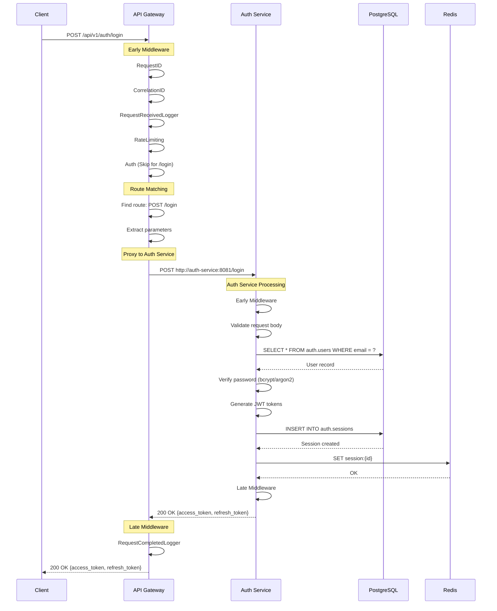

# Server Architecture

Comprehensive documentation of Echo Backend's server implementation, initialization patterns, and request lifecycle - based on **ACTUAL** implementation.

## Table of Contents

- [Service Ports](#service-ports)
- [Initialization Flow](#initialization-flow)
- [Builder Pattern](#builder-pattern)
- [Middleware Architecture](#middleware-architecture)
- [Request Lifecycle](#request-lifecycle)
- [Graceful Shutdown](#graceful-shutdown)
- [Creating a New Service](#creating-a-new-service)

---

## Service Ports

### External Services (Publicly Accessible)

| Service | Port | Access | Description |
|---------|------|--------|-------------|
| **API Gateway** | 8080 | Public | Entry point for all client requests |
| **Location Service** | 8090 | Public | Phone number geolocation lookup |

### Internal Services (Docker Network Only)

| Service | Port | Access | Description |
|---------|------|--------|-------------|
| **Auth Service** | 8081 | Internal | Authentication & session management |
| **User Service** | 8082 | Internal | User profiles & contacts |
| **Message Service** | 8083 | Internal | Real-time messaging + WebSocket |
| **Media Service** | 8084 | Internal | Media uploads & thumbnails |
| **Presence Service** | 8085 | Internal | Online status tracking |

### Infrastructure

| Component | Port | Protocol | Description |
|-----------|------|----------|-------------|
| **PostgreSQL** | 5432 | TCP | Database server |
| **Redis** | 6379 | TCP | Cache server |
| **Kafka** | 9092 (internal)<br>9093 (host) | TCP | Message broker |
| **Zookeeper** | 2181 | TCP | Kafka coordination |

**Network Configuration:**
```yaml
networks:
  echo-network:
    driver: bridge
```

All services communicate via the `echo-network` Docker bridge network using service names as hostnames.

---

## Initialization Flow

Every service follows this **exact** 13-step initialization sequence.

### Standard Initialization Sequence

```go
func main() {
    // 1. Load environment variables from .env files
    env.LoadEnv()

    // 2. Load configuration (YAML + environment overlay)
    cfg, err := loadConfig()
    if err != nil {
        panic(fmt.Sprintf("Failed to load configuration: %v", err))
    }

    // 3. Create structured logger (Zap)
    log := createLogger(cfg.Service.Name)
    defer log.Sync()

    // 4. Connect to PostgreSQL with connection pooling
    dbClient, err := createDBClient(cfg.Database, log)
    if err != nil {
        log.Fatal("Failed to create database client", logger.Error(err))
    }
    defer func() {
        if dbClient != nil {
            log.Info("Closing database connection")
            if err := dbClient.Close(); err != nil {
                log.Error("Failed to close database connection", logger.Error(err))
            }
        }
    }()

    // 5. Connect to Redis cache (if enabled)
    var cacheClient cache.Cache
    if cfg.Cache.Enabled {
        cacheClient, err = createCacheClient(cfg.Cache, log)
        if err != nil {
            log.Fatal("Failed to create cache client", logger.Error(err))
        }
        defer func() {
            if cacheClient != nil {
                log.Info("Closing cache connection")
                if err := cacheClient.Close(); err != nil {
                    log.Error("Failed to close cache connection", logger.Error(err))
                }
            }
        }()
    }

    // 6. Initialize service-specific infrastructure (e.g., Kafka for message-service)
    // Example from message-service:
    kafkaProducer, err := createKafkaProducer(cfg.Kafka, log)
    if err != nil {
        log.Fatal("Failed to create Kafka producer", logger.Error(err))
    }
    defer kafkaProducer.Close()

    // 7. Initialize repositories
    authRepo := repository.NewAuthRepository(dbClient, log)
    sessionRepo := repository.NewSessionRepo(dbClient, log)

    // 8. Build services using Builder pattern
    authService := service.NewAuthServiceBuilder().
        WithRepo(authRepo).
        WithTokenService(tokenService).
        WithHashingService(hashingService).
        WithCache(cacheClient).
        WithConfig(&cfg.Auth).
        WithLogger(log).
        Build()  // Validates all required dependencies

    // 9. Initialize handlers
    authHandler := handler.NewAuthHandler(authService, sessionService, locationService, log)

    // 10. Setup health checks
    healthMgr := setupHealthChecks(dbClient, cacheClient, cfg)
    healthHandler := health.NewHandler(healthMgr)

    // 11. Create router with middleware
    routerInstance, err := createRouter(authHandler, healthHandler, log)
    if err != nil {
        log.Fatal("Failed to create router", logger.Error(err))
    }

    // 12. Create HTTP server
    serverCfg := &server.Config{
        Host:           cfg.Server.Host,
        Port:           cfg.Server.Port,
        ReadTimeout:    cfg.Server.ReadTimeout,
        WriteTimeout:   cfg.Server.WriteTimeout,
        IdleTimeout:    cfg.Server.IdleTimeout,
        MaxHeaderBytes: cfg.Server.MaxHeaderBytes,
        Handler:        routerInstance.Mux(),
    }
    srv, err := server.New(serverCfg, log)
    if err != nil {
        log.Fatal("Failed to create server", logger.Error(err))
    }

    // 13. Setup graceful shutdown and start server
    shutdownMgr := setupShutdownManager(srv, log, cfg)

    serverErrors := make(chan error, 1)
    go func() {
        log.Info("Starting server",
            logger.String("host", cfg.Server.Host),
            logger.Int("port", cfg.Server.Port),
        )
        serverErrors <- srv.Start()
    }()

    select {
    case err := <-serverErrors:
        if err != nil && !errors.Is(err, http.ErrServerClosed) {
            log.Fatal("Server error", logger.Error(err))
        }
        log.Info("Server stopped")

    case <-waitForShutdown(shutdownMgr):
        log.Info("Service stopped gracefully")
    }
}
```

### Configuration Loading

Services support three configuration loading strategies:

**1. File-based (with environment overlay):**
```go
cfg, err := config.Load("configs/config.yaml", "development")
// Loads: config.yaml + config.development.yaml
```

**2. Environment-only:**
```go
cfg, err := config.LoadFromEnv()
// Loads entirely from environment variables
```

**3. Hybrid (file + environment variables):**
```yaml
database:
  host: ${DB_HOST:localhost}     # Environment var with default
  port: ${DB_PORT:5432}
  user: ${DB_USER:echo}
```

Environment variable precedence: `ENV_VAR > config.{env}.yaml > config.yaml`

---

## Builder Pattern

The Builder pattern ensures **compile-time safety** and **dependency validation** for service construction.

### Service Builder Pattern

**Example from Auth Service:**

```go
type AuthServiceBuilder struct {
    repo            AuthRepository
    loginHistoryRepo LoginHistoryRepository
    tokenService    token.JWTTokenService
    hashingService  hashing.HashingService
    cache           cache.Cache
    config          *AuthConfig
    logger          logger.Logger
}

func NewAuthServiceBuilder() *AuthServiceBuilder {
    return &AuthServiceBuilder{}
}

func (b *AuthServiceBuilder) WithRepo(repo AuthRepository) *AuthServiceBuilder {
    b.repo = repo
    return b
}

func (b *AuthServiceBuilder) WithTokenService(tokenService token.JWTTokenService) *AuthServiceBuilder {
    b.tokenService = tokenService
    return b
}

// ... more With methods ...

func (b *AuthServiceBuilder) Build() *AuthService {
    // Validate all required dependencies
    if b.repo == nil {
        panic("AuthService requires a repository")
    }
    if b.logger == nil {
        panic("AuthService requires a logger")
    }
    // ... validate all required fields ...

    return &AuthService{
        repo:            b.repo,
        loginHistoryRepo: b.loginHistoryRepo,
        tokenService:    b.tokenService,
        hashingService:  b.hashingService,
        cache:           b.cache,
        config:          b.config,
        logger:          b.logger,
    }
}
```

**Usage:**
```go
authService := service.NewAuthServiceBuilder().
    WithRepo(authRepo).
    WithLoginHistoryRepo(loginHistoryRepo).
    WithTokenService(tokenService).
    WithHashingService(hashingService).
    WithCache(cacheClient).
    WithConfig(&cfg.Auth).
    WithLogger(log).
    Build()  // Panics if dependencies missing
```

### Router Builder Pattern

**Example from Message Service:**

```go
func createRouter(
    messageHandler *handler.MessageHandler,
    conversationHandler *handler.ConversationHandler,
    wsHandler *websocket.Handler,
    healthHandler *health.Handler,
    cfg *config.Config,
    log logger.Logger,
) (*router.Router, error) {

    builder := router.NewBuilder().
        WithHealthEndpoint("/health", healthHandler.Health).
        WithNotFoundHandler(func(w http.ResponseWriter, r *http.Request) {
            response.RouteNotFoundError(r.Context(), r, w, log)
        }).
        WithMethodNotAllowedHandler(func(w http.ResponseWriter, r *http.Request) {
            response.MethodNotAllowedError(r.Context(), r, w)
        }).
        WithEarlyMiddleware(
            router.Middleware(middleware.Timeout(30*time.Second)),
            router.Middleware(middleware.BodyLimit(10*1024*1024)),
            router.Middleware(middleware.RequestReceivedLogger(log)),
            router.Middleware(middleware.RateLimit(middleware.RateLimitConfig{
                RequestsPerWindow: 100,
                Window:            time.Minute,
            })),
            router.Middleware(middleware.InterceptUserId()),
            router.Middleware(middleware.InterceptSessionId()),
            router.Middleware(middleware.InterceptSessionToken()),
        ).
        WithLateMiddleware(
            router.Middleware(middleware.Recovery(log)),
            router.Middleware(middleware.RequestCompletedLogger(log)),
        )

    // Register routes
    builder = builder.WithRoutes(func(r *router.Router) {
        r.Get("/ws", wsHandler.HandleConnection)
        r.Post("/", messageHandler.SendMessage)
        r.Get("/", messageHandler.GetMessages)
        r.Put("/{id}", messageHandler.EditMessage)
        r.Delete("/{id}", messageHandler.DeleteMessage)
        r.Post("/read", messageHandler.MarkAsRead)
        r.Post("/typing", messageHandler.SetTypingIndicator)
    })

    // Register route groups
    builder = builder.WithRoutesGroup("/conversations", func(rg *router.RouteGroup) {
        rg.Post("", conversationHandler.CreateConversation)
        rg.Get("", conversationHandler.GetConversations)
    })

    return builder.Build(), nil
}
```

**Key Methods:**
- `WithEarlyMiddleware()` - Runs **before** route matching
- `WithLateMiddleware()` - Runs **after** route matching
- `WithMiddlewareChain()` - Apply custom middleware chain
- `WithRoutes()` - Register individual routes
- `WithRoutesGroup()` - Register route groups with prefix
- `Build()` - Creates final router instance

---

## Middleware Architecture

### Middleware Execution Order

```
┌─────────────────────────────────────────────────────┐
│ 1. EARLY MIDDLEWARE (Before Route Matching)        │
│    - RequestID                                       │
│    - CorrelationID                                   │
│    - RequestReceivedLogger                           │
│    - Rate Limiting                                   │
│    - Auth (JWT validation)                           │
│    - Timeout                                         │
│    - BodyLimit                                       │
├─────────────────────────────────────────────────────┤
│ 2. ROUTE MATCHING                                   │
│    - Find matching route                             │
│    - Extract path parameters                         │
├─────────────────────────────────────────────────────┤
│ 3. HANDLER EXECUTION                                │
│    - Execute route handler                           │
│    - Call service layer                              │
│    - Repository operations                           │
│    - Build response                                  │
├─────────────────────────────────────────────────────┤
│ 4. LATE MIDDLEWARE (After Handler)                 │
│    - RequestCompletedLogger                          │
│    - Recovery (panic handler)                        │
└─────────────────────────────────────────────────────┘
```

### Available Middleware

**1. RequestID** (`services/auth-service:139`)
```go
middleware.RequestID(headers.XRequestID)
```
- Generates/extracts unique request ID
- Sets `X-Request-ID` header
- Stores in context for logging

**2. CorrelationID** (`services/api-gateway:197`)
```go
middleware.CorrelationID(headers.XCorrelationID)
```
- Generates/extracts correlation ID for distributed tracing
- Sets `X-Correlation-ID` header
- Propagates through service calls

**3. RequestReceivedLogger** (`shared/server/middleware/middlewares.go:133`)
```go
middleware.RequestReceivedLogger(log)
```
- Logs incoming request details
- Records start time for duration calculation

**4. RequestCompletedLogger** (`shared/server/middleware/middlewares.go:150`)
```go
middleware.RequestCompletedLogger(log)
```
- Logs request completion with duration
- Includes status code and response size

**5. Recovery** (`shared/server/middleware/middlewares.go:110`)
```go
middleware.Recovery(log)
```
- Catches panics in handlers
- Logs stack trace
- Returns 500 Internal Server Error

**6. Rate Limiting**
```go
// Fixed Window
middleware.FixedWindowRateLimit(100, time.Minute)

// Sliding Window
middleware.SlidingWindowRateLimit(100, time.Minute)

// Token Bucket
middleware.TokenBucketRateLimit(100, time.Minute)
```

**7. Auth (JWT Validation)** (`services/api-gateway:200`)
```go
middleware.Auth(middleware.AuthConfig{
    ValidateToken: func(tokenStr string) (userID string, err error) {
        claims, err := tokenService.Validate(ctx, tokenStr, token.TokenTypeAccess)
        if err != nil {
            return "", err
        }
        return claims.Subject, nil
    },
    OnAuthFailed: func(w http.ResponseWriter, r *http.Request, err error) {
        response.UnauthorizedError(r.Context(), r, w, "Authentication failed", err)
    },
    SkipPaths: []string{"/health", "/register", "/login"},
})
```

**8. Timeout** (`shared/server/middleware/middlewares.go:60`)
```go
middleware.Timeout(30 * time.Second)
```

**9. BodyLimit**
```go
middleware.BodyLimit(10 * 1024 * 1024)  // 10 MB
```

**10. Security Headers** (`services/api-gateway:108`)
```go
middleware.SecurityHeaders(cfg.Security.SecurityHeaders)
```
- X-Content-Type-Options: nosniff
- X-Frame-Options: DENY
- X-XSS-Protection: 1; mode=block
- Strict-Transport-Security

**11. CORS** (`services/api-gateway:110`)
```go
middleware.CORS(allowedOrigins, allowedMethods, allowedHeaders)
```

**12. Compression** (`services/api-gateway:114`)
```go
middleware.Compression(middleware.CompressionConfig{
    Level:   4,
    MinSize: 1024,
    ContentTypes: []string{"application/json", "text/plain"},
})
```

### Middleware Chain Pattern

**Creating a Chain:**
```go
commonChain := middleware.NewChain()
commonChain.Append(middleware.Recovery(log))
commonChain.Append(middleware.SecurityHeaders(cfg.Security.SecurityHeaders))
commonChain.Append(middleware.APIVersion(headers.XAPIVersion, cfg.Service.Version))
commonChain.Append(middleware.CORS(cfg.Security.AllowedOrigins, ...))

builder = builder.WithMiddlewareChain(commonChain)
```

---

## Request Lifecycle

### Complete Request Flow



### Detailed Step Breakdown

**1. Request Arrives at API Gateway (Port 8080)**
```
POST http://localhost:8080/api/v1/auth/login
Headers:
  Content-Type: application/json
Body:
  {
    "email": "user@example.com",
    "password": "SecurePass123!"
  }
```

**2. Early Middleware Chain (API Gateway)**
- `RequestID`: Generates `X-Request-ID: req_abc123`
- `CorrelationID`: Generates `X-Correlation-ID: corr_xyz789`
- `RequestReceivedLogger`: Logs "HTTP request received"
- `RateLimiting`: Checks rate limit (skip if under limit)
- `Auth`: Checks JWT token (skip for `/login` - in SkipPaths)

**3. Route Matching**
- API Gateway finds proxy route: `/api/v1/auth/*` → `http://auth-service:8081`
- Path transformation: `/api/v1/auth/login` → `/login`

**4. Proxy Request to Auth Service**
```
POST http://auth-service:8081/login
Headers:
  X-Request-ID: req_abc123
  X-Correlation-ID: corr_xyz789
  Content-Type: application/json
Body:
  {
    "email": "user@example.com",
    "password": "SecurePass123!"
  }
```

**5. Auth Service Processing**

**Early Middleware:**
- `RequestReceivedLogger`: Logs "HTTP request received" with correlation ID

**Handler Execution:**
```go
// services/auth-service/api/v1/handler/login.go

func (h *AuthHandler) Login(w http.ResponseWriter, r *http.Request) {
    // 1. Parse request
    req := dto.NewLoginRequest()
    if err := json.NewDecoder(r.Body).Decode(req); err != nil {
        response.BadRequestError(r.Context(), r, w, "Invalid request", err)
        return
    }

    // 2. Call service layer
    output, err := h.service.Login(r.Context(), serviceModels.LoginInput{
        Email:    req.Email,
        Password: req.Password,
        DeviceID: req.DeviceID,
    })
    if err != nil {
        // Handle error
        return
    }

    // 3. Create session
    session, err := h.sessionService.CreateSession(r.Context(), ...)
    if err != nil {
        // Handle error
        return
    }

    // 4. Return response
    response.OK(r.Context(), r, w, "Login successful", map[string]interface{}{
        "user_id":       output.UserID,
        "session_id":    session.ID,
        "access_token":  session.AccessToken,
        "refresh_token": session.RefreshToken,
        "expires_at":    session.ExpiresAt,
    })
}
```

**Service Layer:**
```go
// 1. Find user by email
user, err := s.repo.FindByEmail(ctx, email)

// 2. Verify password
valid, err := s.hashingService.VerifyPassword(password, user.PasswordHash)

// 3. Create session
session, err := s.sessionRepo.Create(ctx, &models.Session{
    UserID:   user.ID,
    DeviceID: deviceID,
    IPAddress: extractIP(ctx),
})

// 4. Generate tokens
accessToken, err := s.tokenService.Generate(ctx, token.Claims{
    Subject: user.ID.String(),
}, token.TokenTypeAccess)

refreshToken, err := s.tokenService.Generate(ctx, token.Claims{
    Subject: user.ID.String(),
}, token.TokenTypeRefresh)

// 5. Cache session in Redis
s.cache.Set(ctx, fmt.Sprintf("session:%s", session.ID), session, 15*time.Minute)

return &LoginOutput{
    UserID:       user.ID,
    AccessToken:  accessToken,
    RefreshToken: refreshToken,
}
```

**Late Middleware:**
- `RequestCompletedLogger`: Logs "HTTP request completed" with duration

**6. Response Returned to API Gateway**
```json
{
  "success": true,
  "data": {
    "user_id": "550e8400-e29b-41d4-a716-446655440000",
    "session_id": "7c9e6679-7425-40de-944b-e07fc1f90ae7",
    "access_token": "eyJhbGciOiJIUzI1NiIs...",
    "refresh_token": "eyJhbGciOiJIUzI1NiIs...",
    "expires_at": "2025-01-15T11:30:00Z"
  }
}
```

**7. API Gateway Late Middleware**
- `RequestCompletedLogger`: Logs final request with total duration

**8. Response Sent to Client**
```
HTTP/1.1 200 OK
Content-Type: application/json
X-Request-ID: req_abc123
X-Correlation-ID: corr_xyz789

{
  "success": true,
  "data": {
    "user_id": "550e8400-e29b-41d4-a716-446655440000",
    "access_token": "eyJhbGciOiJIUzI1NiIs...",
    ...
  }
}
```

---

## Graceful Shutdown

### Shutdown Priority System

The shutdown manager executes hooks in **priority order** with individual timeouts.

**Priority Levels:**
```go
const (
    PriorityHigh   = 100  // Critical infrastructure (HTTP server, WebSocket)
    PriorityNormal = 50   // Services, connections
    PriorityLow    = 10   // Cleanup, logging
)
```

### Shutdown Sequence

**Example from Message Service:**

```go
func setupShutdownManager(srv *server.Server, hub *websocket.Hub, log logger.Logger, cfg *config.Config) *shutdown.Manager {
    shutdownMgr := shutdown.New(
        shutdown.WithTimeout(cfg.Server.ShutdownTimeout),  // Global timeout: 30s
        shutdown.WithLogger(log),
    )

    // HIGH PRIORITY (100) - Execute first
    shutdownMgr.RegisterWithPriority(
        "http-server",
        shutdown.ServerShutdownHook(srv),
        shutdown.PriorityHigh,
    )

    shutdownMgr.RegisterWithPriority(
        "websocket-hub",
        shutdown.Hook(func(ctx context.Context) error {
            log.Info("Shutting down WebSocket hub")
            hub.Shutdown()  // Close all WebSocket connections
            return nil
        }),
        shutdown.PriorityHigh,
    )

    // Drain existing connections (if configured)
    if cfg.Shutdown.WaitForConnections && cfg.Shutdown.DrainTimeout > 0 {
        shutdownMgr.RegisterWithOptions(
            "drain-connections",
            shutdown.DelayHook(cfg.Shutdown.DrainTimeout),
            shutdown.PriorityHigh,
            cfg.Shutdown.DrainTimeout,
        )
    }

    // LOW PRIORITY (10) - Execute last
    shutdownMgr.RegisterWithPriority(
        "logger-sync",
        shutdown.Hook(func(ctx context.Context) error {
            log.Info("Syncing logger before shutdown")
            return log.Sync()
        }),
        shutdown.PriorityLow,
    )

    return shutdownMgr
}
```

### Execution Order

When **SIGTERM** or **SIGINT** is received:

```
1. [HIGH PRIORITY] Stop accepting new requests
   └─> HTTP server.Shutdown()
   └─> WebSocket hub.Shutdown()
   └─> Timeout: 30 seconds

2. [HIGH PRIORITY] Drain existing connections
   └─> Wait for in-flight requests to complete
   └─> Timeout: configured drain timeout (e.g., 5 seconds)

3. [NORMAL PRIORITY] Close infrastructure connections
   └─> Database client.Close()
   └─> Redis client.Close()
   └─> Kafka producer.Close()
   └─> Timeout: 10 seconds each

4. [LOW PRIORITY] Final cleanup
   └─> Logger sync
   └─> Flush buffers
   └─> Timeout: 5 seconds
```

**Total Shutdown Time:** Maximum 30 seconds (configurable via `cfg.Server.ShutdownTimeout`)

### Signal Handling

```go
func waitForShutdown(shutdownMgr *shutdown.Manager) <-chan struct{} {
    done := make(chan struct{})
    go func() {
        defer close(done)
        if err := shutdownMgr.Wait(); err != nil {
            // Log shutdown errors
        }
    }()
    return done
}

// In main()
select {
case err := <-serverErrors:
    if err != nil && !errors.Is(err, http.ErrServerClosed) {
        log.Fatal("Server error", logger.Error(err))
    }
    log.Info("Server stopped")

case <-waitForShutdown(shutdownMgr):
    log.Info("Service stopped gracefully")
}
```

**Signals Handled:**
- `SIGTERM` (Docker stop, Kubernetes termination)
- `SIGINT` (Ctrl+C)

---

## Creating a New Service

Follow this checklist to create a new service following the established patterns.

### Step 1: Create Service Directory

```bash
mkdir -p services/my-service/{cmd/server,internal/{config,handler,service,repo,model,health/checkers},configs,api/v1}
```

**Standard Structure:**
```
services/my-service/
├── cmd/
│   └── server/
│       └── main.go              # Entry point (13-step initialization)
├── internal/
│   ├── config/
│   │   ├── config.go           # Configuration struct
│   │   ├── loader.go           # Config loading logic
│   │   └── validator.go        # Validation rules
│   ├── handler/                # HTTP handlers
│   │   └── my_handler.go
│   ├── service/                # Business logic (Builder pattern)
│   │   └── my_service.go
│   ├── repo/                   # Data access layer
│   │   └── my_repo.go
│   ├── model/                  # Domain models
│   │   └── my_model.go
│   └── health/                 # Health checks
│       ├── manager.go
│       ├── handler.go
│       └── checkers/
│           ├── database.go
│           └── cache.go
├── configs/
│   ├── config.yaml             # Base configuration
│   ├── config.dev.yaml         # Development overrides
│   └── config.prod.yaml        # Production overrides
├── api/
│   └── v1/                     # API version 1
│       └── handler/
│           └── my_handler.go
├── Dockerfile                  # Production build
├── Dockerfile.dev              # Development build (hot reload)
├── go.mod
└── go.sum
```

### Step 2: Create main.go (13-Step Initialization)

```go
package main

import (
    "context"
    "errors"
    "fmt"
    "net/http"

    "my-service/internal/config"
    "my-service/internal/handler"
    "my-service/internal/health"
    "my-service/internal/health/checkers"
    "my-service/internal/repo"
    "my-service/internal/service"

    "shared/pkg/cache"
    "shared/pkg/cache/redis"
    "shared/pkg/database"
    "shared/pkg/database/postgres"
    "shared/pkg/logger"
    adapter "shared/pkg/logger/adapter"
    env "shared/server/env"
    coreMiddleware "shared/server/middleware"
    "shared/server/response"
    "shared/server/router"
    "shared/server/server"
    "shared/server/shutdown"
)

func main() {
    // 1. Load environment variables
    env.LoadEnv()

    // 2. Load configuration
    cfg, err := loadConfig()
    if err != nil {
        panic(fmt.Sprintf("Failed to load configuration: %v", err))
    }

    // 3. Create structured logger
    log := createLogger(cfg.Service.Name)
    defer log.Sync()

    // 4. Connect to PostgreSQL
    dbClient, err := createDBClient(cfg.Database, log)
    if err != nil {
        log.Fatal("Failed to create database client", logger.Error(err))
    }
    defer dbClient.Close()

    // 5. Connect to Redis (if enabled)
    var cacheClient cache.Cache
    if cfg.Cache.Enabled {
        cacheClient, err = createCacheClient(cfg.Cache, log)
        if err != nil {
            log.Fatal("Failed to create cache client", logger.Error(err))
        }
        defer cacheClient.Close()
    }

    // 6. Initialize repositories
    myRepo := repo.NewMyRepository(dbClient, log)

    // 7. Build services using Builder pattern
    myService := service.NewMyServiceBuilder().
        WithRepo(myRepo).
        WithCache(cacheClient).
        WithConfig(&cfg.MyService).
        WithLogger(log).
        Build()

    // 8. Initialize handlers
    myHandler := handler.NewMyHandler(myService, log)

    // 9. Setup health checks
    healthMgr := setupHealthChecks(dbClient, cacheClient, cfg)
    healthHandler := health.NewHandler(healthMgr)

    // 10. Create router with middleware
    routerInstance, err := createRouter(myHandler, healthHandler, log)
    if err != nil {
        log.Fatal("Failed to create router", logger.Error(err))
    }

    // 11. Create HTTP server
    serverCfg := &server.Config{
        Host:           cfg.Server.Host,
        Port:           cfg.Server.Port,
        ReadTimeout:    cfg.Server.ReadTimeout,
        WriteTimeout:   cfg.Server.WriteTimeout,
        IdleTimeout:    cfg.Server.IdleTimeout,
        MaxHeaderBytes: cfg.Server.MaxHeaderBytes,
        Handler:        routerInstance.Mux(),
    }
    srv, err := server.New(serverCfg, log)
    if err != nil {
        log.Fatal("Failed to create server", logger.Error(err))
    }

    // 12. Setup graceful shutdown
    shutdownMgr := setupShutdownManager(srv, log, cfg)

    // 13. Start server and wait for signals
    serverErrors := make(chan error, 1)
    go func() {
        log.Info("Starting My Service",
            logger.String("address", srv.Address()),
        )
        serverErrors <- srv.Start()
    }()

    select {
    case err := <-serverErrors:
        if err != nil && !errors.Is(err, http.ErrServerClosed) {
            log.Fatal("Server error", logger.Error(err))
        }
    case <-waitForShutdown(shutdownMgr):
        log.Info("My Service stopped gracefully")
    }
}

// Helper functions: loadConfig, createLogger, createDBClient, etc.
// (Follow patterns from auth-service/cmd/server/main.go)
```

### Step 3: Create Service Layer (Builder Pattern)

```go
// services/my-service/internal/service/my_service.go

package service

import (
    "context"
    "my-service/internal/model"
    "my-service/internal/repo"

    "shared/pkg/cache"
    "shared/pkg/logger"
)

type MyService struct {
    repo   repo.MyRepository
    cache  cache.Cache
    config *MyServiceConfig
    logger logger.Logger
}

type MyServiceBuilder struct {
    repo   repo.MyRepository
    cache  cache.Cache
    config *MyServiceConfig
    logger logger.Logger
}

func NewMyServiceBuilder() *MyServiceBuilder {
    return &MyServiceBuilder{}
}

func (b *MyServiceBuilder) WithRepo(repo repo.MyRepository) *MyServiceBuilder {
    b.repo = repo
    return b
}

func (b *MyServiceBuilder) WithCache(cache cache.Cache) *MyServiceBuilder {
    b.cache = cache
    return b
}

func (b *MyServiceBuilder) WithConfig(config *MyServiceConfig) *MyServiceBuilder {
    b.config = config
    return b
}

func (b *MyServiceBuilder) WithLogger(logger logger.Logger) *MyServiceBuilder {
    b.logger = logger
    return b
}

func (b *MyServiceBuilder) Build() *MyService {
    // Validate required dependencies
    if b.repo == nil {
        panic("MyService requires a repository")
    }
    if b.logger == nil {
        panic("MyService requires a logger")
    }
    if b.config == nil {
        panic("MyService requires configuration")
    }

    return &MyService{
        repo:   b.repo,
        cache:  b.cache,
        config: b.config,
        logger: b.logger,
    }
}

// Business logic methods
func (s *MyService) DoSomething(ctx context.Context, input *model.DoSomethingInput) (*model.DoSomethingOutput, error) {
    s.logger.Info("Doing something", logger.String("input", input.ID))

    // Business logic here
    result, err := s.repo.FindByID(ctx, input.ID)
    if err != nil {
        return nil, err
    }

    return &model.DoSomethingOutput{
        Result: result,
    }, nil
}
```

### Step 4: Create Router

```go
func createRouter(
    myHandler *handler.MyHandler,
    healthHandler *health.Handler,
    log logger.Logger,
) (*router.Router, error) {

    builder := router.NewBuilder().
        WithHealthEndpoint("/health", healthHandler.Health).
        WithNotFoundHandler(func(w http.ResponseWriter, r *http.Request) {
            response.RouteNotFoundError(r.Context(), r, w, log)
        }).
        WithMethodNotAllowedHandler(func(w http.ResponseWriter, r *http.Request) {
            response.MethodNotAllowedError(r.Context(), r, w)
        }).
        WithEarlyMiddleware(
            router.Middleware(coreMiddleware.RequestReceivedLogger(log)),
            router.Middleware(coreMiddleware.Timeout(30*time.Second)),
            router.Middleware(coreMiddleware.BodyLimit(10*1024*1024)),
        ).
        WithLateMiddleware(
            router.Middleware(coreMiddleware.Recovery(log)),
            router.Middleware(coreMiddleware.RequestCompletedLogger(log)),
        )

    // Register routes
    builder = builder.WithRoutes(func(r *router.Router) {
        r.Get("/", myHandler.GetAll)
        r.Post("/", myHandler.Create)
        r.Get("/{id}", myHandler.GetByID)
        r.Put("/{id}", myHandler.Update)
        r.Delete("/{id}", myHandler.Delete)
    })

    return builder.Build(), nil
}
```

### Step 5: Create Docker Configuration

**Dockerfile.dev (Hot Reload):**
```dockerfile
FROM golang:1.25-alpine

WORKDIR /app

# Install air for hot reload
RUN go install github.com/air-verse/air@latest

# Copy go workspace files
COPY go.work go.work.sum ./

# Copy shared modules
COPY shared/ ./shared/

# Copy service code
COPY services/my-service/ ./services/my-service/

WORKDIR /app/services/my-service

# Download dependencies
RUN go mod download

# Expose port
EXPOSE 8091

# Run with air (hot reload)
CMD ["air", "-c", ".air.toml"]
```

**Dockerfile (Production):**
```dockerfile
FROM golang:1.25-alpine AS builder

WORKDIR /app

COPY go.work go.work.sum ./
COPY shared/ ./shared/
COPY services/my-service/ ./services/my-service/

WORKDIR /app/services/my-service

RUN CGO_ENABLED=0 GOOS=linux go build -a -installsuffix cgo -o bin/my-service cmd/server/main.go

FROM alpine:latest

RUN apk --no-cache add ca-certificates

WORKDIR /root/

COPY --from=builder /app/services/my-service/bin/my-service .
COPY --from=builder /app/services/my-service/configs ./configs

EXPOSE 8091

CMD ["./my-service"]
```

### Step 6: Add to Docker Compose

```yaml
# infra/docker/docker-compose.dev.yml

services:
  my-service:
    build:
      context: ${PWD}
      dockerfile: services/my-service/Dockerfile.dev
    container_name: echo-my-service
    expose:
      - "8091"
    environment:
      SERVER_HOST: 0.0.0.0
      SERVER_PORT: 8091
      APP_ENV: development
      DB_HOST: postgres
      DB_PORT: 5432
      DB_USER: ${POSTGRES_USER:-echo}
      DB_PASSWORD: ${POSTGRES_PASSWORD:-echo_password}
      DB_NAME: ${POSTGRES_DB:-echo_db}
      REDIS_HOST: redis
      REDIS_PORT: 6379
    volumes:
      - ${PWD}/services/my-service:/app/services/my-service
      - ${PWD}/shared:/app/shared
      - go-mod-cache:/go/pkg/mod
      - go-build-cache:/root/.cache/go-build
    networks:
      - echo-network
    depends_on:
      postgres:
        condition: service_healthy
      redis:
        condition: service_healthy
    healthcheck:
      test: ["CMD", "wget", "--no-verbose", "--tries=1", "--spider", "http://localhost:8091/health"]
      interval: 30s
      timeout: 3s
      retries: 3
    restart: unless-stopped
```

### Step 7: Register with API Gateway

```yaml
# services/api-gateway/configs/routes.yaml

router_groups:
  - prefix: /api/v1/my-service
    service: my-service
    transform: /api/v1/my-service -> /
    methods:
      - GET
      - POST
      - PUT
      - DELETE
```

### Step 8: Create Makefile Targets

```makefile
# Makefile

# My Service
.PHONY: my-service-up my-service-down my-service-logs my-service-rerun

my-service-up:
	@echo "Starting My Service..."
	docker-compose -f $(DOCKER_COMPOSE_FILE) up -d my-service

my-service-down:
	@echo "Stopping My Service..."
	docker-compose -f $(DOCKER_COMPOSE_FILE) stop my-service

my-service-logs:
	docker-compose -f $(DOCKER_COMPOSE_FILE) logs -f my-service

my-service-rerun:
	@echo "Restarting My Service..."
	docker-compose -f $(DOCKER_COMPOSE_FILE) stop my-service
	docker-compose -f $(DOCKER_COMPOSE_FILE) rm -f my-service
	docker-compose -f $(DOCKER_COMPOSE_FILE) up -d --build my-service
```

### Checklist

- [ ] Service directory structure created
- [ ] main.go with 13-step initialization
- [ ] Service layer with Builder pattern
- [ ] Repository layer with interface
- [ ] Handler layer with standardized responses
- [ ] Health checks registered
- [ ] Router with middleware chain
- [ ] Graceful shutdown hooks
- [ ] Configuration files (yaml + validation)
- [ ] Dockerfile.dev with hot reload
- [ ] Dockerfile for production
- [ ] Docker Compose entry
- [ ] API Gateway route registration
- [ ] Makefile targets
- [ ] Database migration (if needed)
- [ ] go.mod initialized
- [ ] Added to go.work

---

**Last Updated**: January 2025
**Based on**: Actual implementation in `/services/auth-service`, `/services/message-service`, `/services/api-gateway`
