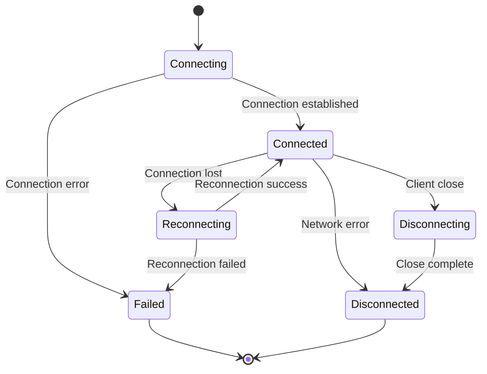

# WebSocket Protocol

Complete WebSocket protocol documentation for real-time messaging in Echo Backend.

## Table of Contents

- [Overview](#overview)
- [Connection](#connection)
- [Message Format](#message-format)
- [Client Events](#client-events)
- [Server Events](#server-events)
- [Heartbeat](#heartbeat)
- [Error Handling](#error-handling)
- [Client Libraries](#client-libraries)

## Overview

Echo Backend uses WebSocket for real-time bidirectional communication between clients and the Message Service. The WebSocket connection enables instant message delivery, typing indicators, read receipts, and presence updates.

**WebSocket Endpoint:**
```
ws://localhost:8083/ws          # Development
wss://api.echo.app/ws           # Production
```

**Supported Platforms:**
- iOS (native WebSocket)
- Android (native WebSocket)
- Web (browser WebSocket API)
- Desktop (Electron, native apps)

## Connection

### Establishing Connection

**WebSocket URL:**
```
ws://localhost:8083/ws
```

**Connection Headers:**
```http
X-User-ID: <user_uuid>
X-Device-ID: <device_id>
X-Platform: ios|android|web
X-Access-Token: <jwt_token>
```

**JavaScript Example:**
```javascript
const socket = new WebSocket('ws://localhost:8083/ws');

// Note: WebSocket in browsers doesn't support custom headers
// Use query parameters instead:
const userId = 'user-uuid';
const deviceId = 'device-123';
const platform = 'web';
const token = 'jwt-token';

const socket = new WebSocket(
  `ws://localhost:8083/ws?user_id=${userId}&device_id=${deviceId}&platform=${platform}&token=${token}`
);

socket.onopen = () => {
  console.log('Connected to WebSocket');
};

socket.onmessage = (event) => {
  const data = JSON.parse(event.data);
  console.log('Received:', data);
};

socket.onerror = (error) => {
  console.error('WebSocket error:', error);
};

socket.onclose = () => {
  console.log('Disconnected from WebSocket');
};
```

**Go Example:**
```go
import "github.com/gorilla/websocket"

headers := http.Header{}
headers.Add("X-User-ID", userID)
headers.Add("X-Device-ID", deviceID)
headers.Add("X-Platform", "ios")
headers.Add("X-Access-Token", accessToken)

conn, _, err := websocket.DefaultDialer.Dial("ws://localhost:8083/ws", headers)
if err != nil {
    log.Fatal(err)
}
defer conn.Close()
```

**Swift Example (iOS):**
```swift
import Foundation

var request = URLRequest(url: URL(string: "ws://localhost:8083/ws")!)
request.setValue(userID, forHTTPHeaderField: "X-User-ID")
request.setValue(deviceID, forHTTPHeaderField: "X-Device-ID")
request.setValue("ios", forHTTPHeaderField: "X-Platform")
request.setValue(accessToken, forHTTPHeaderField: "X-Access-Token")

let socket = URLSessionWebSocketTask(session: URLSession.shared, url: request.url!)
socket.resume()
```

### Connection Established

Once connected, the server sends a connection confirmation:

```json
{
  "type": "connection.established",
  "data": {
    "connection_id": "conn_abc123",
    "user_id": "user-uuid",
    "device_id": "device-123",
    "connected_at": "2024-01-15T10:30:45Z",
    "server_time": "2024-01-15T10:30:45Z"
  },
  "metadata": {
    "timestamp": "2024-01-15T10:30:45Z"
  }
}
```

### Connection States



## Message Format

All messages follow a standard JSON format:

```json
{
  "type": "event.name",
  "data": {
    // Event-specific data
  },
  "metadata": {
    "timestamp": "2024-01-15T10:30:45Z",
    "correlation_id": "corr_xyz789"
  }
}
```

**Fields:**
- `type` (required): Event type identifier
- `data` (required): Event payload
- `metadata` (optional): Additional metadata

## Client Events

Events sent from client to server.

### 1. Send Message

Send a new message to another user.

**Event Type:** `message.send`

**Payload:**
```json
{
  "type": "message.send",
  "data": {
    "to_user_id": "recipient-uuid",
    "content": "Hello! How are you?",
    "message_type": "text",
    "reply_to_id": null,
    "client_message_id": "client_msg_123"
  }
}
```

**Fields:**
- `to_user_id` (required): Recipient's user ID
- `content` (required): Message content
- `message_type` (required): `text`, `image`, `video`, `audio`, `document`, `location`, `contact`
- `reply_to_id` (optional): ID of message being replied to
- `client_message_id` (required): Client-generated ID for deduplication

**Server Response:**
```json
{
  "type": "message.sent",
  "data": {
    "message_id": "msg_abc123",
    "conversation_id": "conv_xyz789",
    "client_message_id": "client_msg_123",
    "from_user_id": "sender-uuid",
    "to_user_id": "recipient-uuid",
    "content": "Hello! How are you?",
    "message_type": "text",
    "status": "sent",
    "created_at": "2024-01-15T10:30:45Z"
  }
}
```

---

### 2. Typing Indicator

Notify that user is typing.

**Event Type:** `presence.typing`

**Payload:**
```json
{
  "type": "presence.typing",
  "data": {
    "conversation_id": "conv_xyz789",
    "is_typing": true
  }
}
```

**Fields:**
- `conversation_id` (required): Conversation ID
- `is_typing` (required): true when typing starts, false when stops

**Server Broadcast:**
Server broadcasts to other participants in the conversation:
```json
{
  "type": "presence.typing",
  "data": {
    "user_id": "sender-uuid",
    "conversation_id": "conv_xyz789",
    "is_typing": true,
    "timestamp": "2024-01-15T10:30:45Z"
  }
}
```

---

### 3. Mark as Read

Mark message(s) as read.

**Event Type:** `message.read`

**Payload:**
```json
{
  "type": "message.read",
  "data": {
    "message_ids": ["msg_abc123", "msg_xyz789"]
  }
}
```

**Server Broadcast:**
Server broadcasts to message sender:
```json
{
  "type": "message.read",
  "data": {
    "message_id": "msg_abc123",
    "read_by": "reader-uuid",
    "read_at": "2024-01-15T10:31:00Z"
  }
}
```

---

### 4. Update Presence

Update user's presence status.

**Event Type:** `presence.update`

**Payload:**
```json
{
  "type": "presence.update",
  "data": {
    "status": "online",
    "activity": "typing"
  }
}
```

**Fields:**
- `status` (required): `online`, `away`, `busy`, `offline`
- `activity` (optional): `typing`, `recording`, `uploading`, `null`

**Server Broadcast:**
Server broadcasts to user's contacts:
```json
{
  "type": "presence.updated",
  "data": {
    "user_id": "user-uuid",
    "status": "online",
    "activity": "typing",
    "last_seen": "2024-01-15T10:30:45Z"
  }
}
```

---

### 5. Heartbeat (Ping)

Keep connection alive.

**Event Type:** `ping`

**Payload:**
```json
{
  "type": "ping"
}
```

**Server Response:**
```json
{
  "type": "pong",
  "data": {
    "timestamp": "2024-01-15T10:30:45Z"
  }
}
```

**Frequency:** Send every 30 seconds

---

## Server Events

Events sent from server to client.

### 1. Message Received

New message received.

**Event Type:** `message.received`

**Payload:**
```json
{
  "type": "message.received",
  "data": {
    "message_id": "msg_abc123",
    "conversation_id": "conv_xyz789",
    "from_user_id": "sender-uuid",
    "to_user_id": "recipient-uuid",
    "content": "Hello!",
    "message_type": "text",
    "reply_to": {
      "message_id": "msg_parent",
      "content": "Hi there!",
      "from_user_id": "other-uuid"
    },
    "created_at": "2024-01-15T10:30:45Z",
    "metadata": {
      "client_id": "msg_client_123"
    }
  }
}
```

**Client Action:**
- Display message in UI
- Send delivery acknowledgment automatically
- Play notification sound (if app in background)

---

### 2. Message Delivered

Message was delivered to recipient.

**Event Type:** `message.delivered`

**Payload:**
```json
{
  "type": "message.delivered",
  "data": {
    "message_id": "msg_abc123",
    "delivered_to": "recipient-uuid",
    "delivered_at": "2024-01-15T10:30:46Z"
  }
}
```

**Client Action:**
- Update message status in UI (single checkmark → double checkmark)

---

### 3. Message Read

Message was read by recipient.

**Event Type:** `message.read`

**Payload:**
```json
{
  "type": "message.read",
  "data": {
    "message_id": "msg_abc123",
    "read_by": "recipient-uuid",
    "read_at": "2024-01-15T10:31:00Z"
  }
}
```

**Client Action:**
- Update message status in UI (double checkmark → blue double checkmark)

---

### 4. Typing Indicator

User is typing.

**Event Type:** `presence.typing`

**Payload:**
```json
{
  "type": "presence.typing",
  "data": {
    "user_id": "typing-user-uuid",
    "conversation_id": "conv_xyz789",
    "is_typing": true,
    "timestamp": "2024-01-15T10:30:45Z"
  }
}
```

**Client Action:**
- Show "User is typing..." indicator
- Auto-hide after 3 seconds if no update received

---

### 5. Presence Updated

User presence changed.

**Event Type:** `presence.updated`

**Payload:**
```json
{
  "type": "presence.updated",
  "data": {
    "user_id": "user-uuid",
    "status": "online",
    "activity": null,
    "last_seen": "2024-01-15T10:30:45Z",
    "devices": ["device-1", "device-2"]
  }
}
```

**Status Values:**
- `online` - User is active
- `away` - User is idle (no activity for 5+ minutes)
- `busy` - Do not disturb mode
- `offline` - User disconnected

**Client Action:**
- Update user status indicator in UI
- Update last seen timestamp

---

### 6. Message Edited

Message was edited.

**Event Type:** `message.edited`

**Payload:**
```json
{
  "type": "message.edited",
  "data": {
    "message_id": "msg_abc123",
    "conversation_id": "conv_xyz789",
    "new_content": "Updated message content",
    "edited_at": "2024-01-15T10:35:45Z",
    "edit_history_count": 1
  }
}
```

**Client Action:**
- Update message content in UI
- Show "edited" indicator

---

### 7. Message Deleted

Message was deleted.

**Event Type:** `message.deleted`

**Payload:**
```json
{
  "type": "message.deleted",
  "data": {
    "message_id": "msg_abc123",
    "conversation_id": "conv_xyz789",
    "deleted_for": "everyone",
    "deleted_at": "2024-01-15T10:40:45Z"
  }
}
```

**Fields:**
- `deleted_for`: `sender_only` or `everyone`

**Client Action:**
- Remove message from UI (if `everyone`)
- Replace with "Message deleted" placeholder

---

### 8. Connection Error

Connection error occurred.

**Event Type:** `error`

**Payload:**
```json
{
  "type": "error",
  "data": {
    "code": "AUTH_FAILED",
    "message": "Invalid access token",
    "fatal": true
  }
}
```

**Error Codes:**
- `AUTH_FAILED` - Authentication failed (fatal)
- `INVALID_MESSAGE` - Malformed message (non-fatal)
- `RATE_LIMIT_EXCEEDED` - Too many messages (non-fatal)
- `INTERNAL_ERROR` - Server error (non-fatal)

**Fatal Errors:**
- Connection will be closed by server
- Client should not attempt automatic reconnection
- User intervention required (e.g., re-login)

**Non-Fatal Errors:**
- Connection remains open
- Client can retry operation
- May trigger temporary rate limiting

---

## Heartbeat

### Purpose

Heartbeat messages keep the WebSocket connection alive and detect disconnections.

### Client Behavior

**Send Ping:**
```javascript
setInterval(() => {
  if (socket.readyState === WebSocket.OPEN) {
    socket.send(JSON.stringify({ type: 'ping' }));
  }
}, 30000); // Every 30 seconds
```

**Handle Pong:**
```javascript
socket.onmessage = (event) => {
  const message = JSON.parse(event.data);

  if (message.type === 'pong') {
    lastPongTime = Date.now();
    // Connection is alive
  }
};
```

### Server Behavior

**Heartbeat Timeout:**
- Server tracks last received message from each client
- If no message received for 60 seconds, server closes connection
- Client should detect close and attempt reconnection

**Stale Connection Cleanup:**
```go
// Server-side cleanup goroutine
ticker := time.NewTicker(30 * time.Second)
defer ticker.Stop()

for range ticker.C {
    now := time.Now()
    for client := range hub.clients {
        if now.Sub(client.lastSeen) > 60*time.Second {
            // Close stale connection
            hub.unregister <- client
        }
    }
}
```

## Error Handling

### Connection Errors

**Connection Refused:**
```
Error: WebSocket connection failed
Cause: Server unavailable or network issue
Action: Retry with exponential backoff
```

**Authentication Failed:**
```json
{
  "type": "error",
  "data": {
    "code": "AUTH_FAILED",
    "message": "Invalid or expired access token",
    "fatal": true
  }
}
```
**Action:** Close connection, refresh token, reconnect

**Rate Limited:**
```json
{
  "type": "error",
  "data": {
    "code": "RATE_LIMIT_EXCEEDED",
    "message": "Too many messages sent",
    "retry_after": 30,
    "fatal": false
  }
}
```
**Action:** Wait `retry_after` seconds before sending next message

### Reconnection Strategy

**Exponential Backoff:**
```javascript
let reconnectDelay = 1000; // Start with 1 second
const maxDelay = 30000;    // Max 30 seconds

function reconnect() {
  setTimeout(() => {
    console.log(`Reconnecting in ${reconnectDelay}ms...`);

    const socket = new WebSocket(wsUrl);

    socket.onopen = () => {
      console.log('Reconnected!');
      reconnectDelay = 1000; // Reset delay
    };

    socket.onerror = () => {
      reconnectDelay = Math.min(reconnectDelay * 2, maxDelay);
      reconnect();
    };
  }, reconnectDelay);
}
```

**Backoff Sequence:**
```
1st attempt: 1 second
2nd attempt: 2 seconds
3rd attempt: 4 seconds
4th attempt: 8 seconds
5th attempt: 16 seconds
6th attempt: 30 seconds (max)
7th+ attempts: 30 seconds
```

### Message Queuing

**Offline Message Queue:**
```javascript
class MessageQueue {
  constructor() {
    this.queue = [];
    this.sending = false;
  }

  enqueue(message) {
    this.queue.push(message);
    this.flush();
  }

  flush() {
    if (this.sending || socket.readyState !== WebSocket.OPEN) {
      return;
    }

    this.sending = true;

    while (this.queue.length > 0 && socket.readyState === WebSocket.OPEN) {
      const message = this.queue.shift();
      socket.send(JSON.stringify(message));
    }

    this.sending = false;
  }
}

const messageQueue = new MessageQueue();

// When connection opens
socket.onopen = () => {
  messageQueue.flush(); // Send queued messages
};

// When sending message
messageQueue.enqueue({
  type: 'message.send',
  data: { ... }
});
```

## Client Libraries

### JavaScript/TypeScript

**Basic Implementation:**
```javascript
class EchoWebSocket {
  constructor(url, options) {
    this.url = url;
    this.options = options;
    this.socket = null;
    this.messageQueue = [];
    this.reconnectDelay = 1000;
    this.maxReconnectDelay = 30000;
  }

  connect() {
    this.socket = new WebSocket(
      `${this.url}?user_id=${this.options.userId}&device_id=${this.options.deviceId}&platform=${this.options.platform}&token=${this.options.accessToken}`
    );

    this.socket.onopen = () => {
      console.log('Connected');
      this.reconnectDelay = 1000;
      this.flushQueue();
      this.options.onConnect?.();
    };

    this.socket.onmessage = (event) => {
      const message = JSON.parse(event.data);
      this.handleMessage(message);
    };

    this.socket.onerror = (error) => {
      console.error('WebSocket error:', error);
      this.options.onError?.(error);
    };

    this.socket.onclose = () => {
      console.log('Disconnected');
      this.options.onDisconnect?.();
      this.reconnect();
    };

    this.startHeartbeat();
  }

  send(message) {
    if (this.socket.readyState === WebSocket.OPEN) {
      this.socket.send(JSON.stringify(message));
    } else {
      this.messageQueue.push(message);
    }
  }

  handleMessage(message) {
    switch (message.type) {
      case 'message.received':
        this.options.onMessageReceived?.(message.data);
        break;
      case 'message.delivered':
        this.options.onMessageDelivered?.(message.data);
        break;
      case 'message.read':
        this.options.onMessageRead?.(message.data);
        break;
      case 'presence.typing':
        this.options.onTyping?.(message.data);
        break;
      case 'presence.updated':
        this.options.onPresenceUpdated?.(message.data);
        break;
      case 'pong':
        this.lastPongTime = Date.now();
        break;
      default:
        console.warn('Unknown message type:', message.type);
    }
  }

  startHeartbeat() {
    this.heartbeatInterval = setInterval(() => {
      if (this.socket.readyState === WebSocket.OPEN) {
        this.send({ type: 'ping' });
      }
    }, 30000);
  }

  reconnect() {
    setTimeout(() => {
      console.log(`Reconnecting in ${this.reconnectDelay}ms...`);
      this.connect();
      this.reconnectDelay = Math.min(
        this.reconnectDelay * 2,
        this.maxReconnectDelay
      );
    }, this.reconnectDelay);
  }

  flushQueue() {
    while (this.messageQueue.length > 0) {
      const message = this.messageQueue.shift();
      this.send(message);
    }
  }

  disconnect() {
    clearInterval(this.heartbeatInterval);
    if (this.socket) {
      this.socket.close();
    }
  }
}

// Usage
const ws = new EchoWebSocket('ws://localhost:8083/ws', {
  userId: 'user-uuid',
  deviceId: 'device-123',
  platform: 'web',
  accessToken: 'jwt-token',

  onConnect: () => console.log('Connected!'),
  onDisconnect: () => console.log('Disconnected!'),
  onMessageReceived: (message) => console.log('New message:', message),
  onMessageDelivered: (data) => console.log('Delivered:', data.message_id),
  onMessageRead: (data) => console.log('Read:', data.message_id),
  onTyping: (data) => console.log('Typing:', data.user_id),
  onPresenceUpdated: (data) => console.log('Presence:', data),
});

ws.connect();
```

---

**Last Updated**: January 2025
**Version**: 1.0.0
